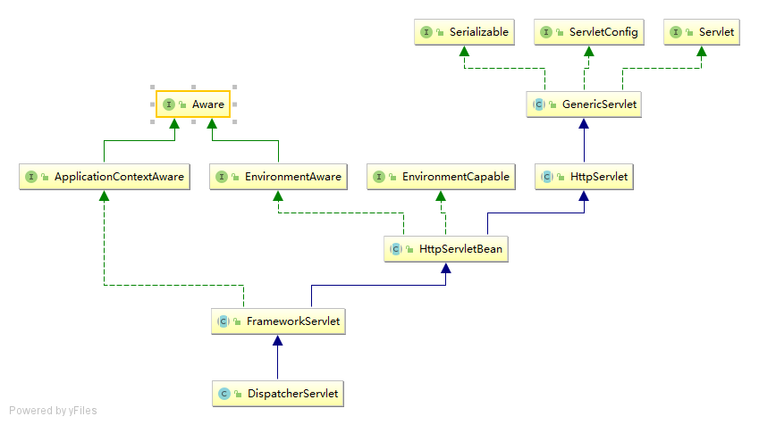
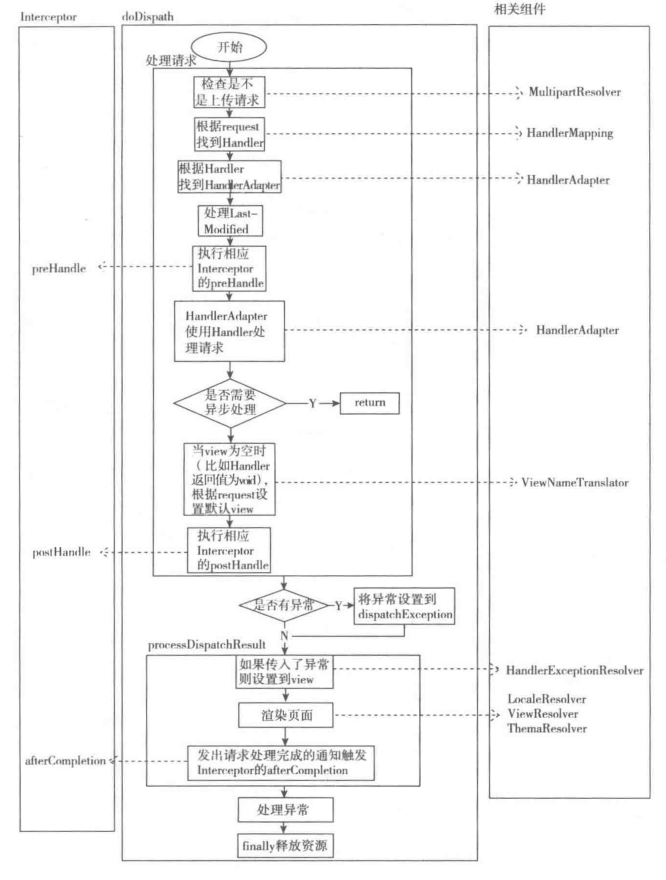
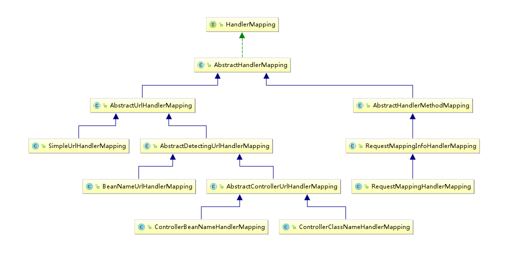
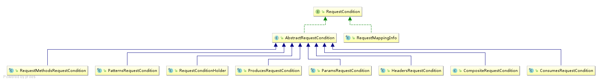
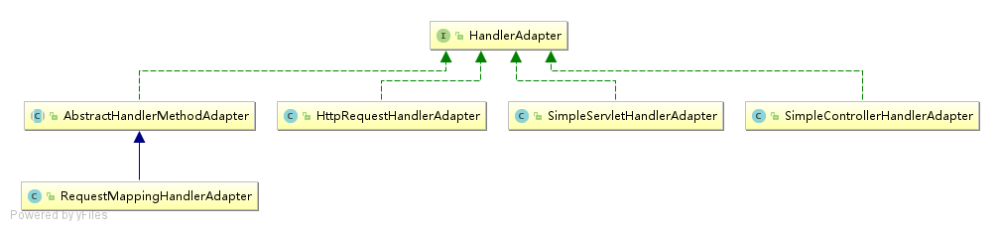
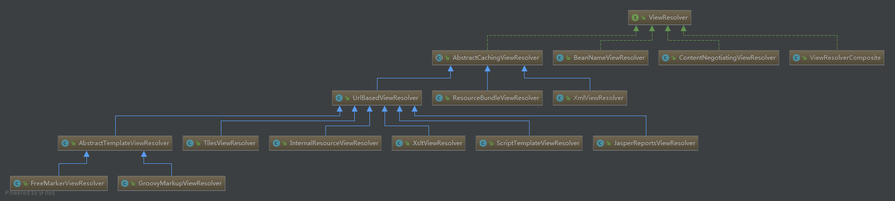

# SpringMVC学习总结

## 1初始化流程

>> Servlet的整体继承结构一共有五个类，GenericServlet和HttpServlet是在Java中，HttpServletBean,FrameworkServlet和DispatcherServlet是在SpringMVC中的。
>> XXXAware在spring里表示对XXX的感知：如果某个类里面想要使用spring里面的一些东西，就可以通过事项XXXAware接口，spring看到后就会给你送给过来接受方式通过setXXX方法。
>> EnvironmentCapable，实现此接口代表可以提供Environment，当spring需要Environment的时候就会调用getEnvironment()方法。
### 1.1Servlet
Servlet是一套规范
```java
public interface Servlet {
    /**
     * 容器启动的时候运行
     */
    public void init(ServletConfig config) throws ServletException;

    /**
     * 获取ServletConfig
     */
    public ServletConfig getServletConfig();

    /**
     * 处理具体请求
     */
    public void service(ServletRequest req, ServletResponse res)
            throws ServletException, IOException;

    /**
     * 获取Servlet相关信息（需要自己实现）
     */
    public String getServletInfo();

    /**
     * 销毁时释放资源（只调用一次）
     */
    public void destroy();
}
````

```java
public interface ServletConfig {

    /**
     * 返回servlet的名称，web-xml中定义的servlet-name
     */
    public String getServletName();


    /**
     * 获取ServletContext，代表应用本身
     */
    public ServletContext getServletContext();


    /**
     * 获取init-param配置的参数
     */
    public String getInitParameter(String name);


    /**
     * 获取init-param配置的参数名称
     */
    public Enumeration<String> getInitParameterNames();
}
```
ServletConfig是Servlet级别的，而ServletContext是Context级（Application）的并不是只保存参数。
### 1.2GenericServlet
主要做了三件事：
- 实现ServletConfig接口
- 提供无参init方法
- 提供log方法
``` java
public abstract class GenericServlet implements javax.servlet.Servlet, ServletConfig, Serializable {
    private static final String LSTRING_FILE = "javax.servlet.LocalStrings";
    private static ResourceBundle lStrings =
            ResourceBundle.getBundle(LSTRING_FILE);

    private transient ServletConfig config;

    /**
     * 什么都不干，初始化方法由init方法
     */
    public GenericServlet() {
    }
    public void destroy() {
    }
    /**
     * 获取init-param配置的参数,调用ServletConfig里的方法
     */
    public String getInitParameter(String name) {
        ServletConfig sc = getServletConfig();
        if (sc == null) {
            throw new IllegalStateException(
                    lStrings.getString("err.servlet_config_not_initialized"));
        }
        return sc.getInitParameter(name);
    }

    /**
     * 获取init-param配置的参数名称，调用ServletConfig里的方法
     */
    public Enumeration<String> getInitParameterNames() {
        ServletConfig sc = getServletConfig();
        if (sc == null) {
            throw new IllegalStateException(
                    lStrings.getString("err.servlet_config_not_initialized"));
        }

        return sc.getInitParameterNames();
    }

    /**
     * 返回ServletConfig
     */
    public ServletConfig getServletConfig() {
        return config;
    }

    /**
     * 返回ServletContext，调用ServletConfig里的方法
     */
    public ServletContext getServletContext() {
        ServletConfig sc = getServletConfig();
        if (sc == null) {
            throw new IllegalStateException(
                    lStrings.getString("err.servlet_config_not_initialized"));
        }

        return sc.getServletContext();
    }

    public String getServletInfo() {
        return "";
    }

    /**
     * 实现了Servlet的init方法，保存ServletConfig然后条用无参init方法
     */
    public void init(ServletConfig config) throws ServletException {
        this.config = config;
        this.init();
    }

    /**
     * 模板方法，子类实现
     */
    public void init() throws ServletException {

    }

    /**
     * 记录日志，传递给ServletContext的日志实现
     */
    public void log(String msg) {
        getServletContext().log(getServletName() + ": " + msg);
    }

    /**
     * 记录异常，传递给ServletContext的日志实现
     */
    public void log(String message, Throwable t) {
        getServletContext().log(getServletName() + ": " + message, t);
    }

    public abstract void service(ServletRequest req, ServletResponse res)
            throws ServletException, IOException;

    public String getServletName() {
        ServletConfig sc = getServletConfig();
        if (sc == null) {
            throw new IllegalStateException(
                    lStrings.getString("err.servlet_config_not_initialized"));
        }

        return sc.getServletName();
    }
}
```
### 1.3HttpServlet
HttpServlet是用于Http协议实现的Servlet的基类。重写类service方法，将ServletResopnse与ServletRequest转换为HttpServletResopnse与HttpServletRequest，然后根据Http请求类型的不同调用不同的方法
``` java

public void service(ServletRequest req, ServletResponse res)
        throws ServletException, IOException{
    HttpServletRequest  request;
    HttpServletResponse response;
    //如果请求类型不相符，则抛出异常
    if (!(req instanceof HttpServletRequest &&
            res instanceof HttpServletResponse)) {
        throw new ServletException("non-HTTP request or response");
    }
    // 转换request与response类型
    request = (HttpServletRequest) req;
    response = (HttpServletResponse) res;
    // 调用http的处理方法
    service(request, response);
}
protected void service(HttpServletRequest req, HttpServletResponse resp)
        throws ServletException, IOException
{
    String method = req.getMethod();
    // 根据不同类型调用不同方法
    if (method.equals(METHOD_GET)) {
        // 对是否过期进行检查,如果没过期直接304使用缓存
        long lastModified = getLastModified(req);
        if (lastModified == -1) {
            doGet(req, resp);
        } else {
            long ifModifiedSince = req.getDateHeader(HEADER_IFMODSINCE);
            if (ifModifiedSince < lastModified) {
                maybeSetLastModified(resp, lastModified);
                doGet(req, resp);
            } else {
                resp.setStatus(HttpServletResponse.SC_NOT_MODIFIED);
            }
        }

    } else if (method.equals(METHOD_HEAD)) {
        long lastModified = getLastModified(req);
        maybeSetLastModified(resp, lastModified);
        // 调用doGet(),返回Body为空的Reponse
        doHead(req, resp);
    } else if (method.equals(METHOD_POST)) {
        doPost(req, resp);
    } else if (method.equals(METHOD_PUT)) {
        doPut(req, resp);
    } else if (method.equals(METHOD_DELETE)) {
        doDelete(req, resp);
    } else if (method.equals(METHOD_OPTIONS)) {
        // 调试
        doOptions(req,resp);
    } else if (method.equals(METHOD_TRACE)) {
        // 诊断服务器
        doTrace(req,resp);
    } else {
        String errMsg = lStrings.getString("http.method_not_implemented");
        Object[] errArgs = new Object[1];
        errArgs[0] = method;
        errMsg = MessageFormat.format(errMsg, errArgs);
        resp.sendError(HttpServletResponse.SC_NOT_IMPLEMENTED, errMsg);
    }
}
```
HttpServlet将不同请求路由的不同方法,而SpringMVC中有将请求合并统一到一个方法进行处理.

### 1.4 HttpServletBean
>> Servlet创建的时候可以直接条用无参init方法，HttpServletBean的int方法。

```java 

public final void init() throws ServletException {
    if (logger.isDebugEnabled()) {
        logger.debug("Initializing servlet '" + getServletName() + "'");
    }

    // Set bean properties from init parameters.
    try {
        // 将Servlet中配置的参数封装到pvs变量中，requiredProperties为必须参数，如果没有报异常
        PropertyValues pvs = new ServletConfigPropertyValues(getServletConfig(), this.requiredProperties);
        BeanWrapper bw = PropertyAccessorFactory.forBeanPropertyAccess(this);
        ResourceLoader resourceLoader = new ServletContextResourceLoader(getServletContext());
        bw.registerCustomEditor(Resource.class, new ResourceEditor(resourceLoader, getEnvironment()));
        // 模板方法，在子类实现,做初始化工作，
        initBeanWrapper(bw);
        // 将初始化值设置到DispatcherServlet
        bw.setPropertyValues(pvs, true);
    }
    catch (BeansException ex) {
        logger.error("Failed to set bean properties on servlet '" + getServletName() + "'", ex);
        throw ex;
    }

    // 模板方法，子类的初始化入口
    initServletBean();

    if (logger.isDebugEnabled()) {
        logger.debug("Servlet '" + getServletName() + "' configured successfully");
    }
}
```
BeanWrapper是Spring提供的一个可以操作javaBean的工具，可以直接修改javaBean的属性值。
### 1.5 FrameworkServlet
从HttpServletBean知，FrameworkServlet的入口方法为initServletBean()。
``` java

protected final void initServletBean() throws ServletException {
    getServletContext().log("Initializing Spring FrameworkServlet '" + getServletName() + "'");
    if (this.logger.isInfoEnabled()) {
        this.logger.info("FrameworkServlet '" + getServletName() + "': initialization started");
    }
    long startTime = System.currentTimeMillis();

    try {
        // 初始化webApplicationContext
        this.webApplicationContext = initWebApplicationContext();
        // 初始化FrameworkServlet，模板方法子类可以实现
        initFrameworkServlet();
    }
    catch (ServletException ex) {
        this.logger.error("Context initialization failed", ex);
        throw ex;
    }
    catch (RuntimeException ex) {
        this.logger.error("Context initialization failed", ex);
        throw ex;
    }

    if (this.logger.isInfoEnabled()) {
        long elapsedTime = System.currentTimeMillis() - startTime;
        this.logger.info("FrameworkServlet '" + getServletName() + "': initialization completed in " +
                elapsedTime + " ms");
    }
}
```
FrameworkServlet的构建过程主要就是初始化webApplicationContext().
``` java
protected WebApplicationContext initWebApplicationContext() {
    // 获取rootContext
    WebApplicationContext rootContext =
            WebApplicationContextUtils.getWebApplicationContext(getServletContext());
    WebApplicationContext wac = null;
    // 1.存在以WebApplicationContext为参数的构造函数，如果已经通过构造方法设置了webApplicationContext
    if (this.webApplicationContext != null) {
        wac = this.webApplicationContext;
        if (wac instanceof ConfigurableWebApplicationContext) {
            ConfigurableWebApplicationContext cwac = (ConfigurableWebApplicationContext) wac;
            if (!cwac.isActive()) {
                if (cwac.getParent() == null) {
                    cwac.setParent(rootContext);
                }
                configureAndRefreshWebApplicationContext(cwac);
            }
        }
    }
    if (wac == null) {
        // 2.当webApplicationContext已经存在在ServletContext中时，通过配置在Servlet中的contextAttribute参数获取
        wac = findWebApplicationContext();
    }
    if (wac == null) {
        // 3.webApplicationContext没有创建就创建一个。
        wac = createWebApplicationContext(rootContext);
    }

    if (!this.refreshEventReceived) {
        // refreshEventReceived没有触发调用此方法，模板方法子类实现
        onRefresh(wac);
    }
    // 根据publishContext标志是否进行设置，publishContext可以在init-param参数设置。
    if (this.publishContext) {
        // 将ApplicationContext保存到ServletContext中
        String attrName = getServletContextAttributeName();
        getServletContext().setAttribute(attrName, wac);
        if (this.logger.isDebugEnabled()) {
            this.logger.debug("Published WebApplicationContext of servlet '" + getServletName() +
                    "' as ServletContext attribute with name [" + attrName + "]");
        }
    }

    return wac;
}
```
- 获取rootContext根容器的key为：org.springframework.web.context.WebApplicationContext.ROOT
在web.xml中添加一下配置，据classpath:spring/applicationContext.xml下的xml文件生成的rootContext。
```xml
<context-param>
  <param-name>contextConfigLocation</param-name>  
  <param-value>classpath:spring/applicationContext.xml</param-value>  
</context-param>
<listener>
  <listener-class>org.springframework.web.context.ContextLoaderListener</listener-class>  
</listener>
```
- 初始化WebApplicationContext
1. 构造方法获取
2. web.xml中配置了，contextAttribute属性
```xml
<servlet>
    <servlet-name>dispatcher</servlet-name>
    <servlet-class>org.springframework.web.servlet.DispatcherServlet</servlet-class>
    <init-param>
      <param-name>contextAttribute</param-name>
      <param-value>dispatcher</param-value>
    </init-param>
    <load-on-startup>1</load-on-startup>

  </servlet>
```  
3. 自己创建。一般都是这种情况
```java 
protected WebApplicationContext createWebApplicationContext(ApplicationContext parent) {
    // 获取创建类型
    Class<?> contextClass = getContextClass();
    if (this.logger.isDebugEnabled()) {
        this.logger.debug("Servlet with name '" + getServletName() +
                "' will try to create custom WebApplicationContext context of class '" +
                contextClass.getName() + "'" + ", using parent context [" + parent + "]");
    }
    // 检查创建类型
    if (!ConfigurableWebApplicationContext.class.isAssignableFrom(contextClass)) {
        throw new ApplicationContextException(
                "Fatal initialization error in servlet with name '" + getServletName() +
                "': custom WebApplicationContext class [" + contextClass.getName() +
                "] is not of type ConfigurableWebApplicationContext");
    }
    // 创建
    ConfigurableWebApplicationContext wac =
            (ConfigurableWebApplicationContext) BeanUtils.instantiateClass(contextClass);

    wac.setEnvironment(getEnvironment());
    wac.setParent(parent);
    // 将设置的contextConfigLocation参数传给wac，默认传入WEN-INFO/[ServletName]-Servlet.xml
    wac.setConfigLocation(getContextConfigLocation());

    configureAndRefreshWebApplicationContext(wac);

    return wac;
}
protected void configureAndRefreshWebApplicationContext(ConfigurableWebApplicationContext wac) {
    if (ObjectUtils.identityToString(wac).equals(wac.getId())) {
        if (this.contextId != null) {
            wac.setId(this.contextId);
        }
        else {
            wac.setId(ConfigurableWebApplicationContext.APPLICATION_CONTEXT_ID_PREFIX +
                    ObjectUtils.getDisplayString(getServletContext().getContextPath()) + '/' + getServletName());
        }
    }

    wac.setServletContext(getServletContext());
    wac.setServletConfig(getServletConfig());
    wac.setNamespace(getNamespace());
    // 添加ContextRefreshListener监听
    wac.addApplicationListener(new SourceFilteringListener(wac, new ContextRefreshListener()));

    ConfigurableEnvironment env = wac.getEnvironment();
    if (env instanceof ConfigurableWebEnvironment) {
        ((ConfigurableWebEnvironment) env).initPropertySources(getServletContext(), getServletConfig());
    }

    postProcessWebApplicationContext(wac);
    applyInitializers(wac);
    wac.refresh();
}
```
wac添加了监听器
``` java
// 添加ContextRefreshListener监听
wac.addApplicationListener(new SourceFilteringListener(wac, new ContextRefreshListener()));
```
>> SourceFilteringListener可以根据输入参数不同进行选择，实际监听的是ContextRefreshListener监听的事件。ContextRefreshListener是FrameworkServlet的内部类，监听ContextRefreshedEvent事件，当接受到消息时会调用FrameworkServlet的onApplicationEvent方法，在onApplicationEvent中会将refreshEventReceived设置为true并调用onRefresh方法。

- 设置webApplicationContext并根据情况调用onRefresh方法
DispatcherServlet覆写了FrameworkServlet中的onRefresh方法.
###  1.6 DispatcherServlet
onRefresh方法是入口方法。调用了九个初始化方法。
```java 
@Override
protected void onRefresh(ApplicationContext context) {
    initStrategies(context);
}
protected void initStrategies(ApplicationContext context) {
    initMultipartResolver(context);
    initLocaleResolver(context);
    initThemeResolver(context);
    initHandlerMappings(context);
    initHandlerAdapters(context);
    initHandlerExceptionResolvers(context);
    initRequestToViewNameTranslator(context);
    initViewResolvers(context);
    initFlashMapManager(context);
}
```
initStrategies方法主要就是初始化九个组件，以initLocaleResolver为例
``` java
private void initLocaleResolver(ApplicationContext context) {
    try {
        // 在容器内查找localeResolver
        this.localeResolver = context.getBean(LOCALE_RESOLVER_BEAN_NAME, LocaleResolver.class);
        if (logger.isDebugEnabled()) {
            logger.debug("Using LocaleResolver [" + this.localeResolver + "]");
        }
    }
    catch (NoSuchBeanDefinitionException ex) {
        // 容器内没有就获取默认组件
        this.localeResolver = getDefaultStrategy(context, LocaleResolver.class);
        if (logger.isDebugEnabled()) {
            logger.debug("Unable to locate LocaleResolver with name '" + LOCALE_RESOLVER_BEAN_NAME +
                    "': using default [" + this.localeResolver + "]");
        }
    }
}
```
默认组件获取
``` java
protected <T> T getDefaultStrategy(ApplicationContext context, Class<T> strategyInterface) {
    List<T> strategies = getDefaultStrategies(context, strategyInterface);
    if (strategies.size() != 1) {
        throw new BeanInitializationException(
                "DispatcherServlet needs exactly 1 strategy for interface [" + strategyInterface.getName() + "]");
    }
    return strategies.get(0);
}
protected <T> List<T> getDefaultStrategies(ApplicationContext context, Class<T> strategyInterface) {
    String key = strategyInterface.getName();
    // 从defaultStrategies获取所需策略的属性
    String value = defaultStrategies.getProperty(key);
    if (value != null) {
        // 如果有多个策略以‘，’分割
        String[] classNames = StringUtils.commaDelimitedListToStringArray(value);
        List<T> strategies = new ArrayList<T>(classNames.length);
        // 按获取到的类型初始化策略
        for (String className : classNames) {
            try {
                Class<?> clazz = ClassUtils.forName(className, DispatcherServlet.class.getClassLoader());
                Object strategy = createDefaultStrategy(context, clazz);
                strategies.add((T) strategy);
            }
            catch (ClassNotFoundException ex) {
                throw new BeanInitializationException(
                        "Could not find DispatcherServlet's default strategy class [" + className +
                                "] for interface [" + key + "]", ex);
            }
            catch (LinkageError err) {
                throw new BeanInitializationException(
                        "Error loading DispatcherServlet's default strategy class [" + className +
                                "] for interface [" + key + "]: problem with class file or dependent class", err);
            }
        }
        return strategies;
    }
    else {
        return new LinkedList<T>();
    }
}
```
defaultStrategies的初始化在一个静态代码块
``` java
static {
    // Load default strategy implementations from properties file.
    // This is currently strictly internal and not meant to be customized
    // by application developers.
    try {
        ClassPathResource resource = new ClassPathResource(DEFAULT_STRATEGIES_PATH, DispatcherServlet.class);
        defaultStrategies = PropertiesLoaderUtils.loadProperties(resource);
    }
    catch (IOException ex) {
        throw new IllegalStateException("Could not load 'DispatcherServlet.properties': " + ex.getMessage());
    }
}
```
defaultStrategie是DispatchServlet类所在包下的DispatcherServlet.properties文件内定义键值对。这个文件一共定义了八个组件，处理文件上传的组件没有默认配置。
## 2 请求处理
>> 本章主要介绍SpringMVC是怎么处理请求的。
### 2.1 HttpServletBean
没有处理请求的工作
### 2.2 FrameworkServlet
>> 在FrameworkServlet中重写了service，doGet、doPost、doPut、doDelete、doOptions、doTrace方法（除了doHead）。在Service中添加了PATCH类型请求的处理。doOptions和doTrace方法可以通过参数决定是自己处理还是交给父类处理。其他的请求都是交给processRequest统一处理。service和doGet方法代码：
``` java
protected void service(HttpServletRequest request, HttpServletResponse response)
        throws ServletException, IOException {
    HttpMethod httpMethod = HttpMethod.resolve(request.getMethod());
    if (HttpMethod.PATCH == httpMethod || httpMethod == null) {
        processRequest(request, response);
    }
    else {
        super.service(request, response);
    }
}
@Override
protected final void doGet(HttpServletRequest request, HttpServletResponse response)
        throws ServletException, IOException {
    processRequest(request, response);
}
```
processRequest方法是FrameworkServlet类中在处理请求的核心：
``` java
protected final void processRequest(HttpServletRequest request, HttpServletResponse response)
        throws ServletException, IOException {
    long startTime = System.currentTimeMillis();
    Throwable failureCause = null;
    // 获取LocaleContextHolder中原来保存的LocaleContext
    LocaleContext previousLocaleContext = LocaleContextHolder.getLocaleContext();
    // 获取当前请求的LocaleContext
    LocaleContext localeContext = buildLocaleContext(request);
    // 获取RequestContextHolder保存的RequestAttributes
    RequestAttributes previousAttributes = RequestContextHolder.getRequestAttributes();
    // 获取当前请求的ServletRequestAttributes
    ServletRequestAttributes requestAttributes = buildRequestAttributes(request, response, previousAttributes);
    // 拿到异步处理器并设置拦截器
    WebAsyncManager asyncManager = WebAsyncUtils.getAsyncManager(request);
    asyncManager.registerCallableInterceptor(FrameworkServlet.class.getName(), new RequestBindingInterceptor());
    // 将当前请求的LocaleContext与ServletRequestAttributes设置到LocaleContextHolder与RequestContextHolder
    initContextHolders(request, localeContext, requestAttributes);

    try {
        // 实际处理请求（子类实现）
        doService(request, response);
    }
    catch (ServletException ex) {
        failureCause = ex;
        throw ex;
    }
    catch (IOException ex) {
        failureCause = ex;
        throw ex;
    }
    catch (Throwable ex) {
        failureCause = ex;
        throw new NestedServletException("Request processing failed", ex);
    }finally {
        // 恢复原来的LocaleContext与ServletRequestAttributes到LocaleContextHolder和RequestContextHolder中
        resetContextHolders(request, previousLocaleContext, previousAttributes);
        if (requestAttributes != null) {
            requestAttributes.requestCompleted();
        }
        if (logger.isDebugEnabled()) {
            if (failureCause != null) {
                this.logger.debug("Could not complete request", failureCause);
            }
            else {
                if (asyncManager.isConcurrentHandlingStarted()) {
                    logger.debug("Leaving response open for concurrent processing");
                }
                else {
                    this.logger.debug("Successfully completed request");
                }
            }
        }
        // 发布ServletRequestHandledEvent消息
        publishRequestHandledEvent(request, response, startTime, failureCause);
    }
}
```
processRequest方法主要做了两件事：
- LocaleContext与RequestAttributes的设置与恢复
    - LocaleContext存放本地化信息Locale（如zh-cn）
    - RequestAttributes通过它可以set/get/remove Attribute,根据参数判断操作request还是session
    ``` java
   
    public void setAttribute(String name, Object value, int scope) {
        if (scope == SCOPE_REQUEST) {
            // 当调用requestCompleted方法后就会变为false不能再操作了
            if (!isRequestActive()) {
                throw new IllegalStateException(
                        "Cannot set request attribute - request is not active anymore!");
            }
            this.request.setAttribute(name, value);
        }
        else {
            HttpSession session = getSession(true);
            this.sessionAttributesToUpdate.remove(name);
            session.setAttribute(name, value);
        }
    }
    ```
    - LocaleContextHolder是抽象类，里面的方法都是statis的
    ``` java
    public abstract class LocaleContextHolder {
	private static final ThreadLocal<LocaleContext> localeContextHolder =
			new NamedThreadLocal<LocaleContext>("LocaleContext");
	private static final ThreadLocal<LocaleContext> inheritableLocaleContextHolder =
			new NamedInheritableThreadLocal<LocaleContext>("LocaleContext");
    }
    ```
- 处理完发布ServletRequestHandledEvent消息
``` java
private void publishRequestHandledEvent(
        HttpServletRequest request, HttpServletResponse response, long startTime, Throwable failureCause) {
    // publishEvents可以在配置Servlet时配置，默认为true
    if (this.publishEvents) {
        // 无论是否执行成功都会发布消息
        long processingTime = System.currentTimeMillis() - startTime;
        int statusCode = (responseGetStatusAvailable ? response.getStatus() : -1);
        this.webApplicationContext.publishEvent(
                new ServletRequestHandledEvent(this,
                        request.getRequestURI(), request.getRemoteAddr(),
                        request.getMethod(), getServletConfig().getServletName(),
                        WebUtils.getSessionId(request), getUsernameForRequest(request),
                        processingTime, failureCause, statusCode));
    }
}
```
记录日志的监听器
```java
@Component
public class ServletRequestHandledEventListener implements ApplicationListener<ServletRequestHandledEvent> {
    final static Log log =  LogFactory.getLog(ServletRequestHandledEventListener.class);
    public void onApplicationEvent(ServletRequestHandledEvent event) {
        log.info("======发布事件：======"+event.getDescription());
    }
}
```
### 2.3 DispatcherServlet
>> DispatcherServlet里面执行处理的入口方法doService。doService并没有直接进行处理而是交给doDispatch进行具体处理。在进行doDispatch处理前首先判断是不是include请求，如果是则对request的Attribute做快照备份。doDispatch处理完成后进行还原。

``` java
@Override
protected void doService(HttpServletRequest request, HttpServletResponse response) throws Exception {
    if (logger.isDebugEnabled()) {
        String resumed = WebAsyncUtils.getAsyncManager(request).hasConcurrentResult() ? " resumed" : "";
        logger.debug("DispatcherServlet with name '" + getServletName() + "'" + resumed +
                " processing " + request.getMethod() + " request for [" + getRequestUri(request) + "]");
    }

    Map<String, Object> attributesSnapshot = null;
    // 当时include请求时，对request的Attribute做快照备份
    if (WebUtils.isIncludeRequest(request)) {
        attributesSnapshot = new HashMap<String, Object>();
        Enumeration<?> attrNames = request.getAttributeNames();
        while (attrNames.hasMoreElements()) {
            String attrName = (String) attrNames.nextElement();
            if (this.cleanupAfterInclude || attrName.startsWith("org.springframework.web.servlet")) {
                attributesSnapshot.put(attrName, request.getAttribute(attrName));
            }
        }
    }

    // 进行一些属性设置
    request.setAttribute(WEB_APPLICATION_CONTEXT_ATTRIBUTE, getWebApplicationContext());
    request.setAttribute(LOCALE_RESOLVER_ATTRIBUTE, this.localeResolver);
    request.setAttribute(THEME_RESOLVER_ATTRIBUTE, this.themeResolver);
    request.setAttribute(THEME_SOURCE_ATTRIBUTE, getThemeSource());
    // FlashMap相关，用与Redirect转发时参数传递。inputFlashMap保存上次请求转发的属性，outputFlashMap保存本次请求需要转发的属性，flashMapManager进行管理
    FlashMap inputFlashMap = this.flashMapManager.retrieveAndUpdate(request, response);
    if (inputFlashMap != null) {
        request.setAttribute(INPUT_FLASH_MAP_ATTRIBUTE, Collections.unmodifiableMap(inputFlashMap));
    }
    request.setAttribute(OUTPUT_FLASH_MAP_ATTRIBUTE, new FlashMap());
    request.setAttribute(FLASH_MAP_MANAGER_ATTRIBUTE, this.flashMapManager);

    try {
        doDispatch(request, response);
    }
    finally {
        if (!WebAsyncUtils.getAsyncManager(request).isConcurrentHandlingStarted()) {
            // 还原快照备份
            if (attributesSnapshot != null) {
                restoreAttributesAfterInclude(request, attributesSnapshot);
            }
        }
    }
}
```
>> doDispatch的任务：1.根据request找到Handler；2.根据Handler找到HandlerAdapter；3.用HandlerAdapter处理Handler；4.调用processDispatchResult方法处理上面处理之后的结果。
``` java
mappedHandler = getHandler(processedRequest);
HandlerAdapter ha = getHandlerAdapter(mappedHandler.getHandler());
mv = ha.handle(processedRequest, response, mappedHandler.getHandler());
processDispatchResult(processedRequest, response, mappedHandler, mv, dispatchException);
```
### 2.4 doDispatch方法
``` java
protected void doDispatch(HttpServletRequest request, HttpServletResponse response) throws Exception {
    HttpServletRequest processedRequest = request;
    HandlerExecutionChain mappedHandler = null;
    boolean multipartRequestParsed = false;

    WebAsyncManager asyncManager = WebAsyncUtils.getAsyncManager(request);

    try {
        ModelAndView mv = null;
        Exception dispatchException = null;

        try {
            // 检查是不是上传请求
            processedRequest = checkMultipart(request);
            multipartRequestParsed = (processedRequest != request);

            // 1.根据request找到Handler
            mappedHandler = getHandler(processedRequest);
            if (mappedHandler == null || mappedHandler.getHandler() == null) {
                noHandlerFound(processedRequest, response);
                return;
            }

            // 2.根据Handler找到HandlerAdapter
            HandlerAdapter ha = getHandlerAdapter(mappedHandler.getHandler());

            // 处理GET，HEAD请求的Last-Modified
            String method = request.getMethod();
            boolean isGet = "GET".equals(method);
            if (isGet || "HEAD".equals(method)) {
                long lastModified = ha.getLastModified(request, mappedHandler.getHandler());
                if (logger.isDebugEnabled()) {
                    logger.debug("Last-Modified value for [" + getRequestUri(request) + "] is: " + lastModified);
                }
                if (new ServletWebRequest(request, response).checkNotModified(lastModified) && isGet) {
                    return;
                }
            }
            // 执行相应Interceptor的preHandler
            if (!mappedHandler.applyPreHandle(processedRequest, response)) {
                return;
            }

            // 3.用HandlerAdapter处理Handler请求
            mv = ha.handle(processedRequest, response, mappedHandler.getHandler());
            // 如果是异步处理，直接返回
            if (asyncManager.isConcurrentHandlingStarted()) {
                return;
            }
            // 单view为空（比如,Handler返回值为void），根据request设置默认view
            applyDefaultViewName(processedRequest, mv);
            // 执行相应Interceptor的postHandler
            mappedHandler.applyPostHandle(processedRequest, response, mv);
        }
        catch (Exception ex) {
            dispatchException = ex;
        }
        catch (Throwable err) {
            dispatchException = new NestedServletException("Handler dispatch failed", err);
        }
        // 4.调用processDispatchResult方法处理上面处理之后的结果。
        processDispatchResult(processedRequest, response, mappedHandler, mv, dispatchException);
    }
    catch (Exception ex) {
        triggerAfterCompletion(processedRequest, response, mappedHandler, ex);
    }
    catch (Throwable err) {
        triggerAfterCompletion(processedRequest, response, mappedHandler,
                new NestedServletException("Handler processing failed", err));
    }
    finally {
        // 判断是否执行异步处理
        if (asyncManager.isConcurrentHandlingStarted()) {
            if (mappedHandler != null) {
                mappedHandler.applyAfterConcurrentHandlingStarted(processedRequest, response);
            }
        }
        else {
            // 删除上传请求资源
            if (multipartRequestParsed) {
                cleanupMultipart(processedRequest);
            }
        }
    }
}
```
>> doDispatch分为两个部分：处理请求和渲染页面。  开头定义了几个变量：
- HttpServletRequest processedRequest：实际处理时所用的request
- HandlerExecutionChain mappedHandler：处理请求的处理器链（包含处理器和对应的Interceptor）
- boolean multipartRequestParsed：是不是上传请求的标志
- ModelAndView mv：封装Model和View的容器
- Exception dispatchException：处理请求过程中的异常
>> 首先判断是否是上传请求如果是将request转换为multipartRequestParsed（HttpServletRequest的子类）。
>> 然后通过getHandler获取Handler处理器链，其中使用带了HandlerMapping，返回值HandlerExecutionChain,包含与当前request匹配的Interceptor和Handler
``` java
protected HandlerExecutionChain getHandler(HttpServletRequest request) throws Exception {
    for (HandlerMapping hm : this.handlerMappings) {
        if (logger.isTraceEnabled()) {
            logger.trace(
                    "Testing handler map [" + hm + "] in DispatcherServlet with name '" + getServletName() + "'");
        }
        HandlerExecutionChain handler = hm.getHandler(request);
        if (handler != null) {
            return handler;
        }
    }
    return null;
}
```
>> HandlerExecutionChain中执行时先执行Interceptor中的preHandler,最后执Handler.  
- doDispatch流程图

## 3 组件分析

### 3.1 HandlerMapping

>> HandlerMapping主要分为两个分支：AbstractUrlHandlerMapping和AbstractHandlerMethodMapping。
#### 3.1.1 AbstractHandlerMapping
>> AbstractHandlerMapping采用模板模式，获取Handler过程通过模板方法getHandlerInternal交给子类。AbstractHandlerMapping中保存了所有配置的interceptors，然后Handler可以根据从reqeust提取的lookupPath将相应的interceptors装配上去。此类的主要作用是设置拦截器。
##### 初始化
>> AbstractHandlerMapping继承WebApplicationObjectSupport，初始化的时候会调用模板方法initApplicationContext方法
``` java
protected void initApplicationContext() throws BeansException {
    extendInterceptors(this.interceptors);
    detectMappedInterceptors(this.adaptedInterceptors);
    initInterceptors();
}
```
   1. extendInterceptors是模板方法，用于子类提供一个添加（或修改）interceptors的入口
   2. detectMappedInterceptors方法用于将SpringMVC容器及父容器的所有MappedInterceptor类型的Bean添加到mappedInterceptors属性。  
``` java
protected void detectMappedInterceptors(List<HandlerInterceptor> mappedInterceptors) {
    mappedInterceptors.addAll(
            BeanFactoryUtils.beansOfTypeIncludingAncestors(
                    getApplicationContext(), MappedInterceptor.class, true, false).values());
}
```    
3. initInterceptors方法是初始化interceptors.将所有interceptor添加到adaptedInterceptors属性里面
``` java
protected void initInterceptors() {
    if (!this.interceptors.isEmpty()) {
        for (int i = 0; i < this.interceptors.size(); i++) {
            Object interceptor = this.interceptors.get(i);
            if (interceptor == null) {
                throw new IllegalArgumentException("Entry number " + i + " in interceptors array is null");
            }
            this.adaptedInterceptors.add(adaptInterceptor(interceptor));
        }
    }
}
```
>> AbstractHandlerMapping的list类型的属性interceptors和adaptedInterceptors以及getMappedInterceptors()返回MappedInterceptor[]。
- interceptors是用于配置SringMVC的拦截器，有两种设置方式:一是注册HandlerMapping是通过属性设置，二是子类通过实现extendInterceptors方法进行修改。
- MappedInterceptor[]进行url请求匹配成功后才添加到HandlerExecutionChain。
- adaptedInterceptors不需要匹配全部添加。
##### 使用
HandlerMapping通过getHandler方法来获取处理器Handler以及拦截器Interceptor。
``` java
public final HandlerExecutionChain getHandler(HttpServletRequest request) throws Exception {
    // 获取handler，子类实现
    Object handler = getHandlerInternal(request);
    if (handler == null) {
        handler = getDefaultHandler();
    }
    if (handler == null) {
        return null;
    }
    // Bean name or resolved handler?
    if (handler instanceof String) {
        String handlerName = (String) handler;
        handler = getApplicationContext().getBean(handlerName);
    }
    // 添加拦截器
    HandlerExecutionChain executionChain = getHandlerExecutionChain(handler, request);
    if (CorsUtils.isCorsRequest(request)) {
        CorsConfiguration globalConfig = this.corsConfigSource.getCorsConfiguration(request);
        CorsConfiguration handlerConfig = getCorsConfiguration(handler, request);
        CorsConfiguration config = (globalConfig != null ? globalConfig.combine(handlerConfig) : handlerConfig);
        executionChain = getCorsHandlerExecutionChain(request, executionChain, config);
    }
    return executionChain;
}
```
- 获取handler：通过模板方法getHandlerInternal获取，如果没有获取默认Handler，如果Handler是String类型这在容器内查找bean
- 添加拦截器getHandlerExecutionChain方法。代码：
``` java
protected HandlerExecutionChain getHandlerExecutionChain(Object handler, HttpServletRequest request) {
    // 创建变量
    HandlerExecutionChain chain = (handler instanceof HandlerExecutionChain ?
            (HandlerExecutionChain) handler : new HandlerExecutionChain(handler));

    String lookupPath = this.urlPathHelper.getLookupPathForRequest(request);
    // 添加符合要求的拦截器
    for (HandlerInterceptor interceptor : this.adaptedInterceptors) {
        if (interceptor instanceof MappedInterceptor) {
            MappedInterceptor mappedInterceptor = (MappedInterceptor) interceptor;
            // MappedInterceptor类型的拦截器只有匹配路径才添加
            if (mappedInterceptor.matches(lookupPath, this.pathMatcher)) {
                chain.addInterceptor(mappedInterceptor.getInterceptor());
            }
        }
        else {
            chain.addInterceptor(interceptor);
        }
    }
    return chain;
}
```
#### 3.1.2 AbstractUrlHandlerMapping
>> 将url与对应的Handler保存在一个map中,在getHandlerInternal方法中从map中获取handler。AbstractUrlHandlerMapping实现具体用url从map中获取handler的过程以及map初始化。这里的map就是AbstractUrlHandlerMapping中的handlerMap，另外还单独定义了处理“/”请求的处理器rootHandler。
``` java
protected Object getHandlerInternal(HttpServletRequest request) throws Exception {
    String lookupPath = getUrlPathHelper().getLookupPathForRequest(request);
    Object handler = lookupHandler(lookupPath, request);
    // 通过url寻找为空
    if (handler == null) {
        // 定义临时变量保存找到的handler
        Object rawHandler = null;
        if ("/".equals(lookupPath)) {
            rawHandler = getRootHandler();
        }
        if (rawHandler == null) {
            rawHandler = getDefaultHandler();
        }
        if (rawHandler != null) {
            // Bean name or resolved handler?
            if (rawHandler instanceof String) {
                String handlerName = (String) rawHandler;
                rawHandler = getApplicationContext().getBean(handlerName);
            }
            // 校验找到的handler是否与reuqest匹配，模板方法
            validateHandler(rawHandler, request);
            handler = buildPathExposingHandler(rawHandler, lookupPath, lookupPath, null);
        }
    }
    if (handler != null && logger.isDebugEnabled()) {
        logger.debug("Mapping [" + lookupPath + "] to " + handler);
    }
    else if (handler == null && logger.isTraceEnabled()) {
        logger.trace("No handler mapping found for [" + lookupPath + "]");
    }
    return handler;
}
```
>> 除了lookupHandler和buildPathExposingHandler其他方法都很好理解。
- lookupHandler是从map中查找handler，很多时候不能找到因为很多handler都是使用匹配模式入“/book/*”。方法代码：
``` java
protected Object lookupHandler(String urlPath, HttpServletRequest request) throws Exception {
    // 直接匹配
    Object handler = this.handlerMap.get(urlPath);
    if (handler != null) {
        // handler为string，从容器中获取
        if (handler instanceof String) {
            String handlerName = (String) handler;
            handler = getApplicationContext().getBean(handlerName);
        }
        validateHandler(handler, request);
        return buildPathExposingHandler(handler, urlPath, urlPath, null);
    }
    // Pattern模式匹配，找到匹配matchingPatterns模式
    List<String> matchingPatterns = new ArrayList<String>();
    for (String registeredPattern : this.handlerMap.keySet()) {
        if (getPathMatcher().match(registeredPattern, urlPath)) {
            matchingPatterns.add(registeredPattern);
        }
        else if (useTrailingSlashMatch()) {
            if (!registeredPattern.endsWith("/") && getPathMatcher().match(registeredPattern + "/", urlPath)) {
                matchingPatterns.add(registeredPattern +"/");
            }
        }
    }
    // Pattern排序
    String bestPatternMatch = null;
    Comparator<String> patternComparator = getPathMatcher().getPatternComparator(urlPath);
    if (!matchingPatterns.isEmpty()) {
        Collections.sort(matchingPatterns, patternComparator);
        if (logger.isDebugEnabled()) {
            logger.debug("Matching patterns for request [" + urlPath + "] are " + matchingPatterns);
        }
        bestPatternMatch = matchingPatterns.get(0);
    }
    if (bestPatternMatch != null) {
        handler = this.handlerMap.get(bestPatternMatch);
        if (handler == null) {
            Assert.isTrue(bestPatternMatch.endsWith("/"));
            handler = this.handlerMap.get(bestPatternMatch.substring(0, bestPatternMatch.length() - 1));
        }
        // Bean name or resolved handler?
        if (handler instanceof String) {
            String handlerName = (String) handler;
            handler = getApplicationContext().getBean(handlerName);
        }
        validateHandler(handler, request);
        String pathWithinMapping = getPathMatcher().extractPathWithinPattern(bestPatternMatch, urlPath);

        // 之前通过sort方法进行排序，然后拿第一个作为bestPatternMatch的，不多有可能有多个Pattern的顺序相同,也即是sort方法返回为0,这里就是处理这种情况。
        Map<String, String> uriTemplateVariables = new LinkedHashMap<String, String>();
        for (String matchingPattern : matchingPatterns) {
            if (patternComparator.compare(bestPatternMatch, matchingPattern) == 0) {
                Map<String, String> vars = getPathMatcher().extractUriTemplateVariables(matchingPattern, urlPath);
                Map<String, String> decodedVars = getUrlPathHelper().decodePathVariables(request, vars);
                uriTemplateVariables.putAll(decodedVars);
            }
        }
        if (logger.isDebugEnabled()) {
            logger.debug("URI Template variables for request [" + urlPath + "] are " + uriTemplateVariables);
        }
        return buildPathExposingHandler(handler, bestPatternMatch, pathWithinMapping, uriTemplateVariables);
    }
    // No handler found...
    return null;
}
```
- buildPathExposingHandler方法用于给查找到的handler设置两个拦截器PathExposingHandlerInterceptor和UriTemplateVariablesHandlerInterceptor.这是两个内部拦截器，主要作用是将当前url实际匹配的Pattern、匹配条件和url模板参数设置到request属性，这样后面就可以直接从request属性获取。
```java
protected Object buildPathExposingHandler(Object rawHandler, String bestMatchingPattern,
        String pathWithinMapping, Map<String, String> uriTemplateVariables) {

    HandlerExecutionChain chain = new HandlerExecutionChain(rawHandler);
    chain.addInterceptor(new PathExposingHandlerInterceptor(bestMatchingPattern, pathWithinMapping));
    if (!CollectionUtils.isEmpty(uriTemplateVariables)) {
        chain.addInterceptor(new UriTemplateVariablesHandlerInterceptor(uriTemplateVariables));
    }
    return chain;
}
private class PathExposingHandlerInterceptor extends HandlerInterceptorAdapter {
    private final String bestMatchingPattern;
    private final String pathWithinMapping;

    public PathExposingHandlerInterceptor(String bestMatchingPattern, String pathWithinMapping) {
        this.bestMatchingPattern = bestMatchingPattern;
        this.pathWithinMapping = pathWithinMapping;
    }

    @Override
    public boolean preHandle(HttpServletRequest request, HttpServletResponse response, Object handler) {
        exposePathWithinMapping(this.bestMatchingPattern, this.pathWithinMapping, request);
        request.setAttribute(INTROSPECT_TYPE_LEVEL_MAPPING, supportsTypeLevelMappings());
        return true;
    }

}
private class UriTemplateVariablesHandlerInterceptor extends HandlerInterceptorAdapter {
    private final Map<String, String> uriTemplateVariables;

    public UriTemplateVariablesHandlerInterceptor(Map<String, String> uriTemplateVariables) {
        this.uriTemplateVariables = uriTemplateVariables;
    }
    @Override
    public boolean preHandle(HttpServletRequest request, HttpServletResponse response, Object handler) {
        exposeUriTemplateVariables(this.uriTemplateVariables, request);
        return true;
    }
}
```
>> map初始化是通过registerHandler方法进行，这个方法不是父类调用是其子类调用。这样不同子类可以通过注册不同的handler。AbstractUrlHandlerMapping有两个registerHandler方法一个是注册多个url到一个处理器，实现就是遍历url调用第二个进行注册。另一个注册过程是，先看原来map有没有传入url没有就添加进去，如果有就看handler是否是同一个如果不是就有问题。还有就是不放“/”或者"/*".
```java
protected void registerHandler(String urlPath, Object handler) throws BeansException, IllegalStateException {
    Assert.notNull(urlPath, "URL path must not be null");
    Assert.notNull(handler, "Handler object must not be null");
    Object resolvedHandler = handler;

    // Eagerly resolve handler if referencing singleton via name.
    if (!this.lazyInitHandlers && handler instanceof String) {
        String handlerName = (String) handler;
        if (getApplicationContext().isSingleton(handlerName)) {
            resolvedHandler = getApplicationContext().getBean(handlerName);
        }
    }

    Object mappedHandler = this.handlerMap.get(urlPath);
    if (mappedHandler != null) {
        if (mappedHandler != resolvedHandler) {
            throw new IllegalStateException(
                    "Cannot map " + getHandlerDescription(handler) + " to URL path [" + urlPath +
                    "]: There is already " + getHandlerDescription(mappedHandler) + " mapped.");
        }
    }
    else {
        if (urlPath.equals("/")) {
            if (logger.isInfoEnabled()) {
                logger.info("Root mapping to " + getHandlerDescription(handler));
            }
            setRootHandler(resolvedHandler);
        }
        else if (urlPath.equals("/*")) {
            if (logger.isInfoEnabled()) {
                logger.info("Default mapping to " + getHandlerDescription(handler));
            }
            setDefaultHandler(resolvedHandler);
        }
        else {
            this.handlerMap.put(urlPath, resolvedHandler);
            if (logger.isInfoEnabled()) {
                logger.info("Mapped URL path [" + urlPath + "] onto " + getHandlerDescription(handler));
            }
        }
    }
}
```
#### 3.1.3 SimpleUrlHandlerMapping
>> 其中定义了一个map变量urlMap，作用为方便配置以及在注册前做一下预处理，将所有url和handler的对应关系放在里面，最后注册前做一些预处理。
>> SimpleUrlHandlerMapping重写了父类initApplicationContext，调用registerHandlers方法完成handler注册。
```java
private final Map<String, Object> urlMap = new LinkedHashMap<String, Object>();
public void initApplicationContext() throws BeansException {
    super.initApplicationContext();
    registerHandlers(this.urlMap);
}
protected void registerHandlers(Map<String, Object> urlMap) throws BeansException {
    if (urlMap.isEmpty()) {
        logger.warn("Neither 'urlMap' nor 'mappings' set on SimpleUrlHandlerMapping");
    }
    else {
        for (Map.Entry<String, Object> entry : urlMap.entrySet()) {
            String url = entry.getKey();
            Object handler = entry.getValue();
            // Prepend with slash if not already present.
            if (!url.startsWith("/")) {
                url = "/" + url;
            }
            // Remove whitespace from handler bean name.
            if (handler instanceof String) {
                handler = ((String) handler).trim();
            }
            registerHandler(url, handler);
        }
    }
}
```
#### 3.1.3 AbstractDetectingUrlHandlerMapping
>> 这个类也通过重写initApplicationContext来注册handler里面调用detectHandlers()，在detectHandlers中根据配置的detectHandlersInAncestorContexts参数从springMVC容器及其父容器找到所有的bean的beanName，然后用determineUrlsForHandler方法对每个beanName解析出对应的urls，如果解析不为空就注册到父类map。determineUrlsForHandler是模板方法子类实现。
```java
public void initApplicationContext() throws ApplicationContextException {
    super.initApplicationContext();
    detectHandlers();
}
protected void detectHandlers() throws BeansException {
    if (logger.isDebugEnabled()) {
        logger.debug("Looking for URL mappings in application context: " + getApplicationContext());
    }
    // 获取容器所有bean的name
    String[] beanNames = (this.detectHandlersInAncestorContexts ?
            BeanFactoryUtils.beanNamesForTypeIncludingAncestors(getApplicationContext(), Object.class) :
            getApplicationContext().getBeanNamesForType(Object.class));

    // 对每个beanName解析url，如果能解析到就注册到父类的map中
    for (String beanName : beanNames) {
        // 使用beanname解析url，模板方法
        String[] urls = determineUrlsForHandler(beanName);
        // 解析到就注册到父类
        if (!ObjectUtils.isEmpty(urls)) {
            registerHandler(urls, beanName);
        }
        else {
            if (logger.isDebugEnabled()) {
                logger.debug("Rejected bean name '" + beanName + "': no URL paths identified");
            }
        }
    }
}
```
AbstractDetectingUrlHandlerMapping存在三个子类：
- DefaultAnnotationHandlerMapping（已经标记为废弃）不分析
- BeanNameUrlHandlerMapping
>> 检查beanNameh和alias是不是以"/"开头,如果是则将其作为url,里面只有一个方法determineUrlsForHandler
```java
protected String[] determineUrlsForHandler(String beanName) {
    List<String> urls = new ArrayList<String>();
    if (beanName.startsWith("/")) {
        urls.add(beanName);
    }
    String[] aliases = getApplicationContext().getAliases(beanName);
    for (String alias : aliases) {
        if (alias.startsWith("/")) {
            urls.add(alias);
        }
    }
    return StringUtils.toStringArray(urls);
}
```
- AbstractControllerUrlHandlerMapping
>>AbstractControllerUrlHandlerMapping是将实现了Contrller接口或注释了@Controller的bean作为Handler,并且可以通过设置excludedClasses和excludedPackages排除一些bean。这里的determineUrlsForHandler方法主要负责将符合条件的Handler找出了，而具体什么url则使用模板方法buildUrlsForHandler交给子类去做。代码（省略日志）：
```java
private Set<String> excludedPackages = Collections.singleton("org.springframework.web.servlet.mvc");
private Set<Class<?>> excludedClasses = Collections.emptySet();
protected String[] determineUrlsForHandler(String beanName) {
    Class<?> beanClass = getApplicationContext().getType(beanName);
    // 判断是不是支持的类型
    if (isEligibleForMapping(beanName, beanClass)) {
        // 模板方法
        return buildUrlsForHandler(beanName, beanClass);
    }
    else {
        return null;
    }
}
protected boolean isEligibleForMapping(String beanName, Class<?> beanClass) {
    if (beanClass == null) {
        return false;
    }
    // 排除excludedClasses里面配置的类
    if (this.excludedClasses.contains(beanClass)) {
        return false;
    }
    String beanClassName = beanClass.getName();
    // 排除excludedPackages里面配置的包下的类
    for (String packageName : this.excludedPackages) {
        if (beanClassName.startsWith(packageName)) {
            return false;
        }
    }
    // 检查是否实现了Controller接口或者注释了@Controller
    return isControllerType(beanClass);
}
```
>> 它有两个子类ControllerBeanNameHandlerMapping和ControllerClassNameHandlerMapping，从名称一个使用className作为url另一个使用spring容器中的beanName作为url。
#### 3.1.4 AbstractHandlerMethodMapping
>> AbstractHandlerMethodMapping系列只有三个类：AbstractHandlerMethodMapping、RequestMappingInfoHandlerMapping和RequestMappingHandlerMapping，这三个类依次继承。AbstractHandlerMethodMapping系列是将Method作为Handler来使用，这是使用最多的Handler，经常使用的@RequestMapping所注释的方法就是这种Handler，它有一个类型--HandlerMethod，也就是Method类型的Handler。
```java
private final Map<T, HandlerMethod> handlerMethods = new LinkedHashMap<T, HandlerMethod>();
private final MultiValueMap<String, T> urlMap = new LinkedMultiValueMap<String, T>();
private final MultiValueMap<String, HandlerMethod> nameMap = new LinkedMultiValueMap<String, HandlerMethod>();
```
>> 这里的泛型T是RequestMappingInfo其实现了RequestCondition这个接口，此接口专门保存从reuqest提取出来用于匹配Handler的条件。结构图：

>> 抽象实现AbstractRequestCondition中重写了equals、hashCode和toString三个方法，有八个子类。除了CompositeRequestCondition外每个子类表示一种匹配条件。CompositeRequestCondition本身不做实际匹配而是将多个RequestCondition封装到一个变量，用的时候遍历变量的所有进行匹配，这就是责任链模式。
>> 另一个实现RequestMappingInfo，它里面用了七个变量保存七个RequestCondition，匹配的时候使用七个变量进行匹配。
>> handlerMethods：保存匹配条件和Handler对应关系。
>> urlMap:保存着url与匹配条件的对应关系。
>> nameMap:保存name与HandlerMethod的对应关系。
>> AbstractHandlerMethodMapping实现了InitializingBean接口，spring容器会自动调用afterPropertiesSet，这个方法有调用了initHandlerMethods方法完成具体的初始化。
```java
public void afterPropertiesSet() {
    initHandlerMethods();
}
protected void initHandlerMethods() {
    if (logger.isDebugEnabled()) {
        logger.debug("Looking for request mappings in application context: " + getApplicationContext());
    }
    String[] beanNames = (this.detectHandlerMethodsInAncestorContexts ?
            BeanFactoryUtils.beanNamesForTypeIncludingAncestors(getApplicationContext(), Object.class) :
            getApplicationContext().getBeanNamesForType(Object.class));

    for (String beanName : beanNames) {
        if (!beanName.startsWith(SCOPED_TARGET_NAME_PREFIX)) {
            Class<?> beanType = null;
            try {
                beanType = getApplicationContext().getType(beanName);
            }
            catch (Throwable ex) {
                // An unresolvable bean type, probably from a lazy bean - let's ignore it.
                if (logger.isDebugEnabled()) {
                    logger.debug("Could not resolve target class for bean with name '" + beanName + "'", ex);
                }
            }
            if (beanType != null && isHandler(beanType)) {
                detectHandlerMethods(beanName);
            }
        }
    }
    handlerMethodsInitialized(getHandlerMethods());
}
//筛选方法RequestMappingHandlerMapping实现，判断时候有相应的注解
protected boolean isHandler(Class<?> beanType) {
    return ((AnnotationUtils.findAnnotation(beanType, Controller.class) != null) ||
            (AnnotationUtils.findAnnotation(beanType, RequestMapping.class) != null));
}
```
>> detectHandlerMethods负责将Handler保存到Map里，handlerMethodsInitialized可以对Handler进行一些初始化模板方法（子类没有实现）
```java
protected void detectHandlerMethods(final Object handler) {
    // 获取Handler类型
    Class<?> handlerType = (handler instanceof String ?
            getApplicationContext().getType((String) handler) : handler.getClass());
    // 如果是cglib代理的子对象，则返回父类型，否则返回传入的类型
    final Class<?> userType = ClassUtils.getUserClass(handlerType);
    // 获取当前bean里所有符合Handler要求的Method
    Map<Method, T> methods = MethodIntrospector.selectMethods(userType,
            new MethodIntrospector.MetadataLookup<T>() {
                @Override
                public T inspect(Method method) {
                    return getMappingForMethod(method, userType);
                }
            });

    if (logger.isDebugEnabled()) {
        logger.debug(methods.size() + " request handler methods found on " + userType + ": " + methods);
    }
    // 进行注册
    for (Map.Entry<Method, T> entry : methods.entrySet()) {
        registerHandlerMethod(handler, entry.getKey(), entry.getValue());
    }
}
//RequestMappingHandlerMapping
protected RequestMappingInfo getMappingForMethod(Method method, Class<?> handlerType) {
    RequestMappingInfo info = createRequestMappingInfo(method);
    if (info != null) {
        RequestMappingInfo typeInfo = createRequestMappingInfo(handlerType);
        if (typeInfo != null) {
            info = typeInfo.combine(info);
        }
    }
    return info;
}
```
- AbstractHandlerMethodMapping使用
>> 类主要通过getHandlerInternal方法获取处理器
```java
protected HandlerMethod getHandlerInternal(HttpServletRequest request) throws Exception {
    // 根据request获取lookupPath
    String lookupPath = getUrlPathHelper().getLookupPathForRequest(request);
    if (logger.isDebugEnabled()) {
        logger.debug("Looking up handler method for path " + lookupPath);
    }
    this.mappingRegistry.acquireReadLock();
    try {
        // 找到handlerMethod
        HandlerMethod handlerMethod = lookupHandlerMethod(lookupPath, request);
        if (logger.isDebugEnabled()) {
            if (handlerMethod != null) {
                logger.debug("Returning handler method [" + handlerMethod + "]");
            }
            else {
                logger.debug("Did not find handler method for [" + lookupPath + "]");
            }
        }
        // 找到调用createWithResolvedBean并返回
        return (handlerMethod != null ? handlerMethod.createWithResolvedBean() : null);
    }
    finally {
        this.mappingRegistry.releaseReadLock();
    }
}

protected HandlerMethod lookupHandlerMethod(String lookupPath, HttpServletRequest request) throws Exception {
    // Match是内部类，保存匹配条件和Handler
    List<Match> matches = new ArrayList<Match>();
    // 根据lookupPath获取匹配条件
    List<T> directPathMatches = this.mappingRegistry.getMappingsByUrl(lookupPath);
    if (directPathMatches != null) {
        // 找到的匹配条件添加到matches
        addMatchingMappings(directPathMatches, matches, request);
    }
    // 如果不能直接使用lookupPath得到匹配条件，则将所有匹配条件加入matches
    if (matches.isEmpty()) {
        addMatchingMappings(this.mappingRegistry.getMappings().keySet(), matches, request);
    }
    // 将包含匹配条件和handler的matches排序，并取第一个作为bestMatch，如果前面两个排序相同则抛出异常
    if (!matches.isEmpty()) {
        Comparator<Match> comparator = new MatchComparator(getMappingComparator(request));
        Collections.sort(matches, comparator);
        if (logger.isTraceEnabled()) {
            logger.trace("Found " + matches.size() + " matching mapping(s) for [" +
                    lookupPath + "] : " + matches);
        }
        Match bestMatch = matches.get(0);
        if (matches.size() > 1) {
            if (CorsUtils.isPreFlightRequest(request)) {
                return PREFLIGHT_AMBIGUOUS_MATCH;
            }
            Match secondBestMatch = matches.get(1);
            if (comparator.compare(bestMatch, secondBestMatch) == 0) {
                Method m1 = bestMatch.handlerMethod.getMethod();
                Method m2 = secondBestMatch.handlerMethod.getMethod();
                throw new IllegalStateException("Ambiguous handler methods mapped for HTTP path '" +
                        request.getRequestURL() + "': {" + m1 + ", " + m2 + "}");
            }
        }
        handleMatch(bestMatch.mapping, lookupPath, request);
        return bestMatch.handlerMethod;
    }
    else {
        return handleNoMatch(this.mappingRegistry.getMappings().keySet(), lookupPath, request);
    }
}
```
>> 这个过程是使用Match作为载体的，Match是一个内部类，封装了匹配条件和HandlerMethod两个属性。handleMatch方法是在返回前做一些处理，默认实现将lookupPath设置到request属性，子类RequestMappingInfoHandlerMapping中进行了重写，将更多的参数设置到了request属性，主要为了以后使用方便。
### 3.2 HandlerAdapter

>> HandlerAdapter是使用Handler来处理请求的类，一共有五个Adapter，其中只有RequestMappingHandlerAdapter有两层，别的都只有一层，有一个已经标记为已废弃。RequestMappingHandlerAdapter的实现最复杂因为所处理的handler是任意方法，其他的都非常简单直接调用handler的固定方法，其中SimpleServletHandlerAdapter代码：
```java
public class SimpleServletHandlerAdapter implements HandlerAdapter {
	@Override
	public boolean supports(Object handler) {
		return (handler instanceof Servlet);
	}
	@Override
	public ModelAndView handle(HttpServletRequest request, HttpServletResponse response, Object handler)
			throws Exception {
		((Servlet) handler).service(request, response);
		return null;
	}
	@Override
	public long getLastModified(HttpServletRequest request, Object handler) {
		return -1;
	}
}
```
#### 3.2.1 RequestMappingHandlerAdapter概述
>> RequestMappingHandlerAdapter的父类AbstractHandlerMethodAdapter也非常简单，代码：
```java
public final boolean supports(Object handler) {
    return (handler instanceof HandlerMethod && supportsInternal((HandlerMethod) handler));
}
public final ModelAndView handle(HttpServletRequest request, HttpServletResponse response, Object handler)
    throws Exception {
    return handleInternal(request, response, (HandlerMethod) handler);
}
public final long getLastModified(HttpServletRequest request, Object handler) {
    return getLastModifiedInternal(request, (HandlerMethod) handler);
}
```
>> RequestMappingHandlerAdapter可以说是整个Spring MVC中最复杂的组件。它的supportsInternal直接返回为true，getLastModifiedInternal直接返回为-1.最重要的就是handleInterna方法，就是这个方法使用Handler处理请求。具体分为三步：
1. 准备处理需要的参数。
2. 使用处理器处理请求。
3. 处理返回值，将不同类型返回值统一处理为ModelAndView。
>> 第二步最简单直接使用反射，第三部也算简单，最麻烦的就是第一步。这一步需要根据处理器进行设置参数，但是参数的类型以及个数都是不确定的。这个过程也使用了大量的组件。
>> 理解参数的绑定需要明白三个问题：
- 都有哪些参数需要绑定：方法的参数、注释了@ModelAttribute和注释了@InitBinder的方法
- 参数的值的来源：
    - request中相关的，包括url，post请求以及请求头包含的值
    - cookie
    - session
    - 设置到FlashMap
    - SessionAttribute
    - @ModelAttribute
- 具体进行绑定的方法


```java
public class RequestMappingHandlerAdapter extends AbstractHandlerMethodAdapter
		implements BeanFactoryAware, InitializingBean {

	private static final boolean completionStagePresent = ClassUtils.isPresent("java.util.concurrent.CompletionStage",
			RequestMappingHandlerAdapter.class.getClassLoader());

    // 使用到的组件
	private List<HandlerMethodArgumentResolver> customArgumentResolvers;
	private HandlerMethodArgumentResolverComposite argumentResolvers;
	private HandlerMethodArgumentResolverComposite initBinderArgumentResolvers;
	private List<HandlerMethodReturnValueHandler> customReturnValueHandlers;
	private HandlerMethodReturnValueHandlerComposite returnValueHandlers;
	private List<ModelAndViewResolver> modelAndViewResolvers;

	private ContentNegotiationManager contentNegotiationManager = new ContentNegotiationManager();

	private List<HttpMessageConverter<?>> messageConverters;

	private List<Object> requestResponseBodyAdvice = new ArrayList<Object>();

	private WebBindingInitializer webBindingInitializer;

	private AsyncTaskExecutor taskExecutor = new SimpleAsyncTaskExecutor("MvcAsync");

	private Long asyncRequestTimeout;

	private CallableProcessingInterceptor[] callableInterceptors = new CallableProcessingInterceptor[0];

	private DeferredResultProcessingInterceptor[] deferredResultInterceptors = new DeferredResultProcessingInterceptor[0];

	private boolean ignoreDefaultModelOnRedirect = false;

	private int cacheSecondsForSessionAttributeHandlers = 0;

	private boolean synchronizeOnSession = false;

	private SessionAttributeStore sessionAttributeStore = new DefaultSessionAttributeStore();

	private ParameterNameDiscoverer parameterNameDiscoverer = new DefaultParameterNameDiscoverer();

	private ConfigurableBeanFactory beanFactory;


	private final Map<Class<?>, SessionAttributesHandler> sessionAttributesHandlerCache =
			new ConcurrentHashMap<Class<?>, SessionAttributesHandler>(64);

	private final Map<Class<?>, Set<Method>> initBinderCache = new ConcurrentHashMap<Class<?>, Set<Method>>(64);

	private final Map<ControllerAdviceBean, Set<Method>> initBinderAdviceCache =
			new LinkedHashMap<ControllerAdviceBean, Set<Method>>();

	private final Map<Class<?>, Set<Method>> modelAttributeCache = new ConcurrentHashMap<Class<?>, Set<Method>>(64);

	private final Map<ControllerAdviceBean, Set<Method>> modelAttributeAdviceCache =
			new LinkedHashMap<ControllerAdviceBean, Set<Method>>();


	public RequestMappingHandlerAdapter() {
		StringHttpMessageConverter stringHttpMessageConverter = new StringHttpMessageConverter();
		stringHttpMessageConverter.setWriteAcceptCharset(false);  // see SPR-7316

		this.messageConverters = new ArrayList<HttpMessageConverter<?>>(4);
		this.messageConverters.add(new ByteArrayHttpMessageConverter());
		this.messageConverters.add(stringHttpMessageConverter);
		this.messageConverters.add(new SourceHttpMessageConverter<Source>());
		this.messageConverters.add(new AllEncompassingFormHttpMessageConverter());
	}
	/**
	 * get和set方法省略
	 */

    // 实现了InitializingBean接口，入口方法
	@Override
	public void afterPropertiesSet() {
		// 初始化requestResponseBodyAdvice
		initControllerAdviceCache();

		if (this.argumentResolvers == null) {
			List<HandlerMethodArgumentResolver> resolvers = getDefaultArgumentResolvers();
			this.argumentResolvers = new HandlerMethodArgumentResolverComposite().addResolvers(resolvers);
		}
		if (this.initBinderArgumentResolvers == null) {
			List<HandlerMethodArgumentResolver> resolvers = getDefaultInitBinderArgumentResolvers();
			this.initBinderArgumentResolvers = new HandlerMethodArgumentResolverComposite().addResolvers(resolvers);
		}
		if (this.returnValueHandlers == null) {
			List<HandlerMethodReturnValueHandler> handlers = getDefaultReturnValueHandlers();
			this.returnValueHandlers = new HandlerMethodReturnValueHandlerComposite().addHandlers(handlers);
		}
	}

	private void initControllerAdviceCache() {
		if (getApplicationContext() == null) {
			return;
		}
		if (logger.isInfoEnabled()) {
			logger.info("Looking for @ControllerAdvice: " + getApplicationContext());
		}

		List<ControllerAdviceBean> beans = ControllerAdviceBean.findAnnotatedBeans(getApplicationContext());
		AnnotationAwareOrderComparator.sort(beans);

		List<Object> requestResponseBodyAdviceBeans = new ArrayList<Object>();

		for (ControllerAdviceBean bean : beans) {
			Set<Method> attrMethods = MethodIntrospector.selectMethods(bean.getBeanType(), MODEL_ATTRIBUTE_METHODS);
			if (!attrMethods.isEmpty()) {
				this.modelAttributeAdviceCache.put(bean, attrMethods);
				if (logger.isInfoEnabled()) {
					logger.info("Detected @ModelAttribute methods in " + bean);
				}
			}
			Set<Method> binderMethods = MethodIntrospector.selectMethods(bean.getBeanType(), INIT_BINDER_METHODS);
			if (!binderMethods.isEmpty()) {
				this.initBinderAdviceCache.put(bean, binderMethods);
				if (logger.isInfoEnabled()) {
					logger.info("Detected @InitBinder methods in " + bean);
				}
			}
			if (RequestBodyAdvice.class.isAssignableFrom(bean.getBeanType())) {
				requestResponseBodyAdviceBeans.add(bean);
				if (logger.isInfoEnabled()) {
					logger.info("Detected RequestBodyAdvice bean in " + bean);
				}
			}
			if (ResponseBodyAdvice.class.isAssignableFrom(bean.getBeanType())) {
				requestResponseBodyAdviceBeans.add(bean);
				if (logger.isInfoEnabled()) {
					logger.info("Detected ResponseBodyAdvice bean in " + bean);
				}
			}
		}
        // 将@ModelAttribute的放在最前面
		if (!requestResponseBodyAdviceBeans.isEmpty()) {
			this.requestResponseBodyAdvice.addAll(0, requestResponseBodyAdviceBeans);
		}
	}

	/**
	 * Return the list of argument resolvers to use including built-in resolvers
	 * and custom resolvers provided via {@link #setCustomArgumentResolvers}.
	 */
	private List<HandlerMethodArgumentResolver> getDefaultArgumentResolvers() {
		List<HandlerMethodArgumentResolver> resolvers = new ArrayList<HandlerMethodArgumentResolver>();

		// Annotation-based argument resolution
		resolvers.add(new RequestParamMethodArgumentResolver(getBeanFactory(), false));
		resolvers.add(new RequestParamMapMethodArgumentResolver());
		resolvers.add(new PathVariableMethodArgumentResolver());
		resolvers.add(new PathVariableMapMethodArgumentResolver());
		resolvers.add(new MatrixVariableMethodArgumentResolver());
		resolvers.add(new MatrixVariableMapMethodArgumentResolver());
		resolvers.add(new ServletModelAttributeMethodProcessor(false));
		resolvers.add(new RequestResponseBodyMethodProcessor(getMessageConverters(), this.requestResponseBodyAdvice));
		resolvers.add(new RequestPartMethodArgumentResolver(getMessageConverters(), this.requestResponseBodyAdvice));
		resolvers.add(new RequestHeaderMethodArgumentResolver(getBeanFactory()));
		resolvers.add(new RequestHeaderMapMethodArgumentResolver());
		resolvers.add(new ServletCookieValueMethodArgumentResolver(getBeanFactory()));
		resolvers.add(new ExpressionValueMethodArgumentResolver(getBeanFactory()));

		// Type-based argument resolution
		resolvers.add(new ServletRequestMethodArgumentResolver());
		resolvers.add(new ServletResponseMethodArgumentResolver());
		resolvers.add(new HttpEntityMethodProcessor(getMessageConverters(), this.requestResponseBodyAdvice));
		resolvers.add(new RedirectAttributesMethodArgumentResolver());
		resolvers.add(new ModelMethodProcessor());
		resolvers.add(new MapMethodProcessor());
		resolvers.add(new ErrorsMethodArgumentResolver());
		resolvers.add(new SessionStatusMethodArgumentResolver());
		resolvers.add(new UriComponentsBuilderMethodArgumentResolver());

		// Custom arguments
		if (getCustomArgumentResolvers() != null) {
			resolvers.addAll(getCustomArgumentResolvers());
		}

		// Catch-all
		resolvers.add(new RequestParamMethodArgumentResolver(getBeanFactory(), true));
		resolvers.add(new ServletModelAttributeMethodProcessor(true));

		return resolvers;
	}

	/**
	 * Return the list of argument resolvers to use for {@code @InitBinder}
	 * methods including built-in and custom resolvers.
	 */
	private List<HandlerMethodArgumentResolver> getDefaultInitBinderArgumentResolvers() {
		List<HandlerMethodArgumentResolver> resolvers = new ArrayList<HandlerMethodArgumentResolver>();

		// Annotation-based argument resolution
		resolvers.add(new RequestParamMethodArgumentResolver(getBeanFactory(), false));
		resolvers.add(new RequestParamMapMethodArgumentResolver());
		resolvers.add(new PathVariableMethodArgumentResolver());
		resolvers.add(new PathVariableMapMethodArgumentResolver());
		resolvers.add(new MatrixVariableMethodArgumentResolver());
		resolvers.add(new MatrixVariableMapMethodArgumentResolver());
		resolvers.add(new ExpressionValueMethodArgumentResolver(getBeanFactory()));

		// Type-based argument resolution
		resolvers.add(new ServletRequestMethodArgumentResolver());
		resolvers.add(new ServletResponseMethodArgumentResolver());

		// Custom arguments
		if (getCustomArgumentResolvers() != null) {
			resolvers.addAll(getCustomArgumentResolvers());
		}

		// Catch-all
		resolvers.add(new RequestParamMethodArgumentResolver(getBeanFactory(), true));

		return resolvers;
	}

	/**
	 * Return the list of return value handlers to use including built-in and
	 * custom handlers provided via {@link #setReturnValueHandlers}.
	 */
	private List<HandlerMethodReturnValueHandler> getDefaultReturnValueHandlers() {
		List<HandlerMethodReturnValueHandler> handlers = new ArrayList<HandlerMethodReturnValueHandler>();

		// Single-purpose return value types
		handlers.add(new ModelAndViewMethodReturnValueHandler());
		handlers.add(new ModelMethodProcessor());
		handlers.add(new ViewMethodReturnValueHandler());
		handlers.add(new ResponseBodyEmitterReturnValueHandler(getMessageConverters()));
		handlers.add(new StreamingResponseBodyReturnValueHandler());
		handlers.add(new HttpEntityMethodProcessor(getMessageConverters(),
				this.contentNegotiationManager, this.requestResponseBodyAdvice));
		handlers.add(new HttpHeadersReturnValueHandler());
		handlers.add(new CallableMethodReturnValueHandler());
		handlers.add(new DeferredResultMethodReturnValueHandler());
		handlers.add(new AsyncTaskMethodReturnValueHandler(this.beanFactory));
		handlers.add(new ListenableFutureReturnValueHandler());
		if (completionStagePresent) {
			handlers.add(new CompletionStageReturnValueHandler());
		}

		// Annotation-based return value types
		handlers.add(new ModelAttributeMethodProcessor(false));
		handlers.add(new RequestResponseBodyMethodProcessor(getMessageConverters(),
				this.contentNegotiationManager, this.requestResponseBodyAdvice));

		// Multi-purpose return value types
		handlers.add(new ViewNameMethodReturnValueHandler());
		handlers.add(new MapMethodProcessor());

		// Custom return value types
		if (getCustomReturnValueHandlers() != null) {
			handlers.addAll(getCustomReturnValueHandlers());
		}

		// Catch-all
		if (!CollectionUtils.isEmpty(getModelAndViewResolvers())) {
			handlers.add(new ModelAndViewResolverMethodReturnValueHandler(getModelAndViewResolvers()));
		}
		else {
			handlers.add(new ModelAttributeMethodProcessor(true));
		}

		return handlers;
	}


	/**
	 * Always return {@code true} since any method argument and return value
	 * type will be processed in some way. A method argument not recognized
	 * by any HandlerMethodArgumentResolver is interpreted as a request parameter
	 * if it is a simple type, or as a model attribute otherwise. A return value
	 * not recognized by any HandlerMethodReturnValueHandler will be interpreted
	 * as a model attribute.
	 */
	@Override
	protected boolean supportsInternal(HandlerMethod handlerMethod) {
		return true;
	}

	@Override
	protected ModelAndView handleInternal(HttpServletRequest request,
			HttpServletResponse response, HandlerMethod handlerMethod) throws Exception {
		ModelAndView mav = null;
        // 检查请求类型是否支持以及session是否必须存在
		checkRequest(request);

		// Execute invokeHandlerMethod in synchronized block if required.
		if (this.synchronizeOnSession) {
            // 
			HttpSession session = request.getSession(false);
			if (session != null) {
				Object mutex = WebUtils.getSessionMutex(session);
				synchronized (mutex) {
					mav = invokeHandlerMethod(request, response, handlerMethod);
				}
			}
		}

		mav = invokeHandlerMethod(request, response, handlerMethod);
        // 检查处理器类是否有@SessionAttribute注解
		if (getSessionAttributesHandler(handlerMethod).hasSessionAttributes()) {
            // 给response设置缓存过期时间
			applyCacheSeconds(response, this.cacheSecondsForSessionAttributeHandlers);
		}
		else {
			prepareResponse(response);
		}

		return mav;
	}

	/**
	 * This implementation always returns -1. An {@code @RequestMapping} method can
	 * calculate the lastModified value, call {@link WebRequest#checkNotModified(long)},
	 * and return {@code null} if the result of that call is {@code true}.
	 */
	@Override
	protected long getLastModifiedInternal(HttpServletRequest request, HandlerMethod handlerMethod) {
		return -1;
	}


	/**
	 * Return the {@link SessionAttributesHandler} instance for the given handler type
	 * (never {@code null}).
	 */
	private SessionAttributesHandler getSessionAttributesHandler(HandlerMethod handlerMethod) {
		Class<?> handlerType = handlerMethod.getBeanType();
		SessionAttributesHandler sessionAttrHandler = this.sessionAttributesHandlerCache.get(handlerType);
		if (sessionAttrHandler == null) {
			synchronized (this.sessionAttributesHandlerCache) {
				sessionAttrHandler = this.sessionAttributesHandlerCache.get(handlerType);
				if (sessionAttrHandler == null) {
					sessionAttrHandler = new SessionAttributesHandler(handlerType, sessionAttributeStore);
					this.sessionAttributesHandlerCache.put(handlerType, sessionAttrHandler);
				}
			}
		}
		return sessionAttrHandler;
	}

	/**
	 * Invoke the {@link RequestMapping} handler method preparing a {@link ModelAndView}
	 * if view resolution is required.
	 * @since 4.2
	 * @see #createInvocableHandlerMethod(HandlerMethod)
	 */
	protected ModelAndView invokeHandlerMethod(HttpServletRequest request,
			HttpServletResponse response, HandlerMethod handlerMethod) throws Exception {

		ServletWebRequest webRequest = new ServletWebRequest(request, response);

        // 用来创建WebDataBinder的，WebDataBinder用于参数绑定，主要功能就是实现参数跟String之间的类型转换，ArgumentResolver在进行参数解析的时候会用到WebDataBinder，另外ModelFactory在更新Model时也会用到它
		WebDataBinderFactory binderFactory = getDataBinderFactory(handlerMethod);
        // 处理Model，1.处理之前对Model进行初始化，2.处理请求完成后对Model参数进行更新
        ModelFactory modelFactory = getModelFactory(handlerMethod, binderFactory);
        // 新建ServletInvocableHandlerMethod并设置解析类
		ServletInvocableHandlerMethod invocableMethod = createInvocableHandlerMethod(handlerMethod);
		invocableMethod.setHandlerMethodArgumentResolvers(this.argumentResolvers);
		invocableMethod.setHandlerMethodReturnValueHandlers(this.returnValueHandlers);
		invocableMethod.setDataBinderFactory(binderFactory);
		invocableMethod.setParameterNameDiscoverer(this.parameterNameDiscoverer);
        // 新建传递参数的ModelAndViewContainer，并将相应的参数设置到Model
        ModelAndViewContainer mavContainer = new ModelAndViewContainer();
        // 将FlashMap中的数据设置到Model
        mavContainer.addAllAttributes(RequestContextUtils.getInputFlashMap(request));
        // 使用modelFactory将SessionAttribute和注释@ModelAttribute的方法参数设置到Model
        modelFactory.initModel(webRequest, mavContainer, invocableMethod);
        // 根据配置对ignoreDefaultModelOnRedirect进行设置
		mavContainer.setIgnoreDefaultModelOnRedirect(this.ignoreDefaultModelOnRedirect);
        // 异步请求相关
		AsyncWebRequest asyncWebRequest = WebAsyncUtils.createAsyncWebRequest(request, response);
		asyncWebRequest.setTimeout(this.asyncRequestTimeout);

		WebAsyncManager asyncManager = WebAsyncUtils.getAsyncManager(request);
		asyncManager.setTaskExecutor(this.taskExecutor);
		asyncManager.setAsyncWebRequest(asyncWebRequest);
		asyncManager.registerCallableInterceptors(this.callableInterceptors);
		asyncManager.registerDeferredResultInterceptors(this.deferredResultInterceptors);

		if (asyncManager.hasConcurrentResult()) {
			Object result = asyncManager.getConcurrentResult();
			mavContainer = (ModelAndViewContainer) asyncManager.getConcurrentResultContext()[0];
			asyncManager.clearConcurrentResult();
			if (logger.isDebugEnabled()) {
				logger.debug("Found concurrent result value [" + result + "]");
			}
			invocableMethod = invocableMethod.wrapConcurrentResult(result);
		}
        // 执行请求
		invocableMethod.invokeAndHandle(webRequest, mavContainer);
		if (asyncManager.isConcurrentHandlingStarted()) {
			return null;
		}
        // 请求完成进行一些后置处理
		return getModelAndView(mavContainer, modelFactory, webRequest);
	}

	/**
	 * Create a {@link ServletInvocableHandlerMethod} from the given {@link HandlerMethod} definition.
	 * @param handlerMethod the {@link HandlerMethod} definition
	 * @return the corresponding {@link ServletInvocableHandlerMethod} (or custom subclass thereof)
	 * @since 4.2
	 */
	protected ServletInvocableHandlerMethod createInvocableHandlerMethod(HandlerMethod handlerMethod) {
		return new ServletInvocableHandlerMethod(handlerMethod);
	}

	private ModelFactory getModelFactory(HandlerMethod handlerMethod, WebDataBinderFactory binderFactory) {
		SessionAttributesHandler sessionAttrHandler = getSessionAttributesHandler(handlerMethod);
		Class<?> handlerType = handlerMethod.getBeanType();
		Set<Method> methods = this.modelAttributeCache.get(handlerType);
		if (methods == null) {
			methods = MethodIntrospector.selectMethods(handlerType, MODEL_ATTRIBUTE_METHODS);
			this.modelAttributeCache.put(handlerType, methods);
		}
		List<InvocableHandlerMethod> attrMethods = new ArrayList<InvocableHandlerMethod>();
		// Global methods first
		for (Entry<ControllerAdviceBean, Set<Method>> entry : this.modelAttributeAdviceCache.entrySet()) {
			if (entry.getKey().isApplicableToBeanType(handlerType)) {
				Object bean = entry.getKey().resolveBean();
				for (Method method : entry.getValue()) {
					attrMethods.add(createModelAttributeMethod(binderFactory, bean, method));
				}
			}
		}
		for (Method method : methods) {
			Object bean = handlerMethod.getBean();
			attrMethods.add(createModelAttributeMethod(binderFactory, bean, method));
		}
		return new ModelFactory(attrMethods, binderFactory, sessionAttrHandler);
	}

	private InvocableHandlerMethod createModelAttributeMethod(WebDataBinderFactory factory, Object bean, Method method) {
		InvocableHandlerMethod attrMethod = new InvocableHandlerMethod(bean, method);
		attrMethod.setHandlerMethodArgumentResolvers(this.argumentResolvers);
		attrMethod.setParameterNameDiscoverer(this.parameterNameDiscoverer);
		attrMethod.setDataBinderFactory(factory);
		return attrMethod;
	}
    // 将符合条件的注释了@InitBinder的方法找出来。
	private WebDataBinderFactory getDataBinderFactory(HandlerMethod handlerMethod) throws Exception {
		Class<?> handlerType = handlerMethod.getBeanType();
        // 检查当前Handler中的InitBinder方法是否已经存在在缓存中
		Set<Method> methods = this.initBinderCache.get(handlerType);
        // 如果没有则查找并设置到缓存
		if (methods == null) {
			methods = MethodIntrospector.selectMethods(handlerType, INIT_BINDER_METHODS);
			this.initBinderCache.put(handlerType, methods);
		}
        // 定义保存InitBinder方法的临时变量
		List<InvocableHandlerMethod> initBinderMethods = new ArrayList<InvocableHandlerMethod>();
		// 将符合条件的全局变量添加到initBinderMethods
		for (Entry<ControllerAdviceBean, Set<Method>> entry : this.initBinderAdviceCache .entrySet()) {
			if (entry.getKey().isApplicableToBeanType(handlerType)) {
				Object bean = entry.getKey().resolveBean();
				for (Method method : entry.getValue()) {
					initBinderMethods.add(createInitBinderMethod(bean, method));
				}
			}
		}
        // 将当前Handler中的InitBinder方法添加到initBinderMethods
		for (Method method : methods) {
			Object bean = handlerMethod.getBean();
			initBinderMethods.add(createInitBinderMethod(bean, method));
		}
        // 创建DataBinderFactory并返回
		return createDataBinderFactory(initBinderMethods);
	}

	private InvocableHandlerMethod createInitBinderMethod(Object bean, Method method) {
		InvocableHandlerMethod binderMethod = new InvocableHandlerMethod(bean, method);
		binderMethod.setHandlerMethodArgumentResolvers(this.initBinderArgumentResolvers);
		binderMethod.setDataBinderFactory(new DefaultDataBinderFactory(this.webBindingInitializer));
		binderMethod.setParameterNameDiscoverer(this.parameterNameDiscoverer);
		return binderMethod;
	}
	protected InitBinderDataBinderFactory createDataBinderFactory(List<InvocableHandlerMethod> binderMethods)
			throws Exception {

		return new ServletRequestDataBinderFactory(binderMethods, getWebBindingInitializer());
	}

	private ModelAndView getModelAndView(ModelAndViewContainer mavContainer,
			ModelFactory modelFactory, NativeWebRequest webRequest) throws Exception {
        // 调用modelFactory的updateModel方法更新Model（包括设置了SessionAttribute和给Model设置BindingResult）
		modelFactory.updateModel(webRequest, mavContainer);
		if (mavContainer.isRequestHandled()) {
			return null;
		}
        ModelMap model = mavContainer.getModel();
        // 根据mavContainer创建ModelAndView
        ModelAndView mav = new ModelAndView(mavContainer.getViewName(), model);
        // 如果mavContainer里的model是RedirectAttributes类型,这则将其设置到FlashMap
		if (!mavContainer.isViewReference()) {
			mav.setView((View) mavContainer.getView());
		}
		if (model instanceof RedirectAttributes) {
			Map<String, ?> flashAttributes = ((RedirectAttributes) model).getFlashAttributes();
			HttpServletRequest request = webRequest.getNativeRequest(HttpServletRequest.class);
			RequestContextUtils.getOutputFlashMap(request).putAll(flashAttributes);
		}
		return mav;
	}
	/**
	 * MethodFilter that matches {@link InitBinder @InitBinder} methods.
	 */
	public static final MethodFilter INIT_BINDER_METHODS = new MethodFilter() {
		@Override
		public boolean matches(Method method) {
			return AnnotationUtils.findAnnotation(method, InitBinder.class) != null;
		}
	};
	/**
	 * MethodFilter that matches {@link ModelAttribute @ModelAttribute} methods.
	 */
	public static final MethodFilter MODEL_ATTRIBUTE_METHODS = new MethodFilter() {
		@Override
		public boolean matches(Method method) {
			return ((AnnotationUtils.findAnnotation(method, RequestMapping.class) == null) &&
					(AnnotationUtils.findAnnotation(method, ModelAttribute.class) != null));
		}
	};
}
```
>> RequestMappingHandlerAdapter的处理请求的过程,下面分析设计的组件.

#### 3.2.2 ModelAndViewContainer
>> ModelAndViewContainer承担着整个请求过程中的数据的传递工作。它除了报错Model和View外还有一些其他的功能。
```java
private boolean ignoreDefaultModelOnRedirect = false;
// 视图，可以是实际视图也可以是String类型的逻辑视图
private Object view;
//默认使用的Model
private final ModelMap defaultModel = new BindingAwareModelMap();
// redirect类型的Model
private ModelMap redirectModel;
// 处理器返回redirect视图的标志
private boolean redirectModelScenario = false;
// 用于设置SessionAttribute使用完的标志
private final SessionStatus sessionStatus = new SimpleSessionStatus();
// 请求是否已经完成的标志
private boolean requestHandled = false;
```
#### 3.2.3 SessionAttributesHandler和SessionAttributeStore


#### 3.2.4 ModelFactory
>> ModelFactory是用来维护Model的，具体用两个功能：初始化Model以及处理器执行后将Model中相应的参数更新到SessionAttributes中。

```java
public void initModel(NativeWebRequest request, ModelAndViewContainer mavContainer, HandlerMethod handlerMethod)
        throws Exception {
    // 从sessionAttributes中取出保存的参数，并合并到mavContainer
    Map<String, ?> sessionAttributes = this.sessionAttributesHandler.retrieveAttributes(request);
    mavContainer.mergeAttributes(sessionAttributes);
    // 执行注释了@ModelAttribute的方法并将结果设置到Model
    invokeModelAttributeMethods(request, mavContainer);
    // 遍历即注释了@ModelAttribute又在@SessionAttributes注释中的参数
    for (String name : findSessionAttributeArguments(handlerMethod)) {
        if (!mavContainer.containsAttribute(name)) {
            Object value = this.sessionAttributesHandler.retrieveAttribute(request, name);
            if (value == null) {
                throw new HttpSessionRequiredException("Expected session attribute '" + name + "'");
            }
            mavContainer.addAttribute(name, value);
        }
    }
}
```
- 执行注释了@ModelAttribute的方法并将结果设置到Model
```java
private void invokeModelAttributeMethods(NativeWebRequest request, ModelAndViewContainer mavContainer)
        throws Exception {
    while (!this.modelMethods.isEmpty()) {
        // 注释了@ModelAttribute的方法
        InvocableHandlerMethod attrMethod = getNextModelMethod(mavContainer).getHandlerMethod();
        // 获取注释@ModelAttribute中设置的value作为参数名
        String modelName = attrMethod.getMethodAnnotation(ModelAttribute.class).value();
        // 如果参数已经在mavContainer中跳过
        if (mavContainer.containsAttribute(modelName)) {
            continue;
        }
        // 执行注释了@ModelAttribute的方法
        Object returnValue = attrMethod.invokeForRequest(request, mavContainer);

        if (!attrMethod.isVoid()){
            // 获取参数名
            String returnValueName = getNameForReturnValue(returnValue, attrMethod.getReturnType());
            if (!mavContainer.containsAttribute(returnValueName)) {
                mavContainer.addAttribute(returnValueName, returnValue);
            }
        }
    }
}

public static String getNameForReturnValue(Object returnValue, MethodParameter returnType) {
    // 获取返回值的@ModelAttribute注释
    ModelAttribute annotation = returnType.getMethodAnnotation(ModelAttribute.class);
    // 设置了value直接返回value的值
    if (annotation != null && StringUtils.hasText(annotation.value())) {
        return annotation.value();
    }
    else {
        // 否则使用getVariableNameForReturnType根据方法、返回值类型和返回值获取参数名
        Method method = returnType.getMethod();
        Class<?> resolvedType = GenericTypeResolver.resolveReturnType(method, returnType.getContainingClass());
        return Conventions.getVariableNameForReturnType(method, resolvedType, returnValue);
    }
}
```
- 遍历即注释了@ModelAttribute又在@SessionAttributes注释中的参数
```java
private List<String> findSessionAttributeArguments(HandlerMethod handlerMethod) {
    List<String> result = new ArrayList<String>();
    // 遍历方法的每个参数，如果有@ModelAttribute注释则获取到它对应的参数名，然后用获取到的参数名和参数的类型检查是不是@SessionAttribute注释，如果在这符合要求
    for (MethodParameter parameter : handlerMethod.getMethodParameters()) {
        if (parameter.hasParameterAnnotation(ModelAttribute.class)) {
            // 获取@ModelAttribute注释的参数对应参数名
            String name = getNameForParameter(parameter);
            if (this.sessionAttributesHandler.isHandlerSessionAttribute(name, parameter.getParameterType())) {
                result.add(name);
            }
        }
    }
    return result;
}
public static String getNameForParameter(MethodParameter parameter) {
    ModelAttribute annot = parameter.getParameterAnnotation(ModelAttribute.class);
    String attrName = (annot != null) ? annot.value() : null;
    // 首先从注释中获取,如果注释中没有使用Conventions的getVariableNameForParameter方法获取
    return StringUtils.hasText(attrName) ? attrName :  Conventions.getVariableNameForParameter(parameter);
}
```
- 更新Model
```java
public void updateModel(NativeWebRequest request, ModelAndViewContainer mavContainer) throws Exception {
    ModelMap defaultModel = mavContainer.getDefaultModel();
    // 如果SessionStatus#setComplete则将SessionAttributes清空，否则将defaultModel相应的参数设置到SessionAttributes
    if (mavContainer.getSessionStatus().isComplete()){
        this.sessionAttributesHandler.cleanupAttributes(request);
    }
    else {
        this.sessionAttributesHandler.storeAttributes(request, defaultModel);
    }
    // 判断请求是否已经处理完成或者是redirect类型的返回值，就是判断是否需要渲染页面，如果需要则给model中相应参数设置BindingResult
    if (!mavContainer.isRequestHandled() && mavContainer.getModel() == defaultModel) {
        updateBindingResult(request, defaultModel);
    }
}
private void updateBindingResult(NativeWebRequest request, ModelMap model) throws Exception {
    // 取出Model中的所有参数
    List<String> keyNames = new ArrayList<String>(model.keySet());
    for (String name : keyNames) {
        Object value = model.get(name);
        // 判断是否需要添加BindingResult
        if (isBindingCandidate(name, value)) {
            String bindingResultKey = BindingResult.MODEL_KEY_PREFIX + name;

            if (!model.containsAttribute(bindingResultKey)) {
                WebDataBinder dataBinder = dataBinderFactory.createBinder(request, value, name);
                model.put(bindingResultKey, dataBinder.getBindingResult());
            }
        }
    }
}
private boolean isBindingCandidate(String attributeName, Object value) {
    // 判断本身是不是其他参数绑定结果的BindingResult，如果是则不需要
    if (attributeName.startsWith(BindingResult.MODEL_KEY_PREFIX)) {
        return false;
    }
    Class<?> attrType = (value != null) ? value.getClass() : null;
    // 判断是不是SessionAttribute管理的属性，如果是返回true
    if (this.sessionAttributesHandler.isHandlerSessionAttribute(attributeName, attrType)) {
        return true;
    }
    // 最后检查是不是空值、数组、Collection等，如果是返回true
    return (value != null && !value.getClass().isArray() && !(value instanceof Collection) &&
            !(value instanceof Map) && !BeanUtils.isSimpleValueType(value.getClass()));
}

```
#### 3.2.5 ServletInvocableHandlerMethod
>> ServletInvocableHandlerMethod其实就是一种HandlerMethod，只是添加了方法执行的功能。 
- HandlerMethod
>> 用于封装Handelr和其中处理请求的Handler，分别对应 其中的bean和method属性.
```java
private final Object bean;
private final Method method;
// 新建HandlerMethod时传入的Handler（bean属性）是String的情况
private final BeanFactory beanFactory;
// 如果method是bridged method则设置为其所对应的原有方法否则设置为method
private final Method bridgedMethod;
// 请求的方法的参数
private final MethodParameter[] parameters;
```
>> 所有的属性都是final，创建之后就不能修改。Handerl如果是String类型，将其变为容器中对应bean的过程在专门方法createWithResolvedBean中
```java
public HandlerMethod createWithResolvedBean() {
    Object handler = this.bean;
    if (this.bean instanceof String) {
        String beanName = (String) this.bean;
        handler = this.beanFactory.getBean(beanName);
    }
    return new HandlerMethod(this, handler);
}
```
>>MethodParameter类型的对象表示一个方法的参数,代码：
```java
    // 参数所在方法
	private final Method method;
    // 参数的构成方法
	private final Constructor<?> constructor;
    // 参数的序号，就是第几个参数
	private final int parameterIndex;
    // 嵌套级别，如果是复合参数会用到，比如：List<String> params参数，则params的嵌套级别为1，List内部的String的嵌套级别为2
	private int nestingLevel = 1;
	// 保存每层嵌套参数的序数
	Map<Integer, Integer> typeIndexesPerLevel;
    // 容器的类型，也就是参数所属方法所在的类
	private volatile Class<?> containingClass;
    // 参数的类型
	private volatile Class<?> parameterType;
    // Type型的参数类型
	private volatile Type genericParameterType;
    // 参数的注释
	private volatile Annotation[] parameterAnnotations;
    // 参数名称查找器
	private volatile ParameterNameDiscoverer parameterNameDiscoverer;
    // 参数名称
	private volatile String parameterName;

```
>> MethodParameter中最重要的是method和parameterIndex，有了这两个参数后参数类型、注释等都可以获取到。不过在正常的反射技术里是不知道参数名的，所以这里专门使用了一个参数名查找的组件parameterNameDiscoverer，它可以查找出我们定义参数时参数的名称，这就给ArgumentResolver的解析提供方便。  

>> 在HandlerMethod中定义了两个内部类来封装参数，一个封装方法调用的参数，一个封装方法返回的参数。
```java
private class HandlerMethodParameter extends MethodParameter {
    public HandlerMethodParameter(int index) {
        super(HandlerMethod.this.bridgedMethod, index);
    }
    @Override
    public Class<?> getDeclaringClass() {
        return HandlerMethod.this.getBeanType();
    }
    @Override
    public <T extends Annotation> T getMethodAnnotation(Class<T> annotationType) {
        return HandlerMethod.this.getMethodAnnotation(annotationType);
    }
}
private class ReturnValueMethodParameter extends HandlerMethodParameter {
    private final Object returnValue;
    public ReturnValueMethodParameter(Object returnValue) {
        super(-1);
        this.returnValue = returnValue;
    }
    @Override
    public Class<?> getParameterType() {
        return (this.returnValue != null ? this.returnValue.getClass() : super.getParameterType());
    }
}
```
- InvocableHandlerMethod
>> InvocableHandlerMethod继承自HandlerMethod,在父类的基础上添加了调用功能，也就是说InvocableHandlerMethod可以直接调用内部属性method对应的方法。这个类添加个三个属性：
```java
    // 用于参数解析器ArgumentResolver
    private WebDataBinderFactory dataBinderFactory;
    // 用于解析参数
    private HandlerMethodArgumentResolverComposite argumentResolvers = new HandlerMethodArgumentResolverComposite();
    // 用来获取参数名，用于MethodParameter
	private ParameterNameDiscoverer parameterNameDiscoverer = new DefaultParameterNameDiscoverer();
```
InvocableHandlerMethod中Method调用的方法是invokeForRequest
```java
public Object invokeForRequest(NativeWebRequest request, ModelAndViewContainer mavContainer,
        Object... providedArgs) throws Exception {

    Object[] args = getMethodArgumentValues(request, mavContainer, providedArgs);
    if (logger.isTraceEnabled()) {
        StringBuilder sb = new StringBuilder("Invoking [");
        sb.append(getBeanType().getSimpleName()).append(".");
        sb.append(getMethod().getName()).append("] method with arguments ");
        sb.append(Arrays.asList(args));
        logger.trace(sb.toString());
    }
    Object returnValue = doInvoke(args);
    if (logger.isTraceEnabled()) {
        logger.trace("Method [" + getMethod().getName() + "] returned [" + returnValue + "]");
    }
    return returnValue;
}
```
主要做了两件事：一是准备方法所需要的参数，使用的是getMethodArgumentValues方法，另一条用于具体调用Method，具体使用的是doInvoke方法这个方法是实际执行请求处理的方法。
```java
protected Object doInvoke(Object... args) throws Exception {
    ReflectionUtils.makeAccessible(getBridgedMethod());
    try {
        return getBridgedMethod().invoke(getBean(), args);
    }
    catch (IllegalArgumentException ex) {
        assertTargetBean(getBridgedMethod(), getBean(), args);
        String message = (ex.getMessage() != null ? ex.getMessage() : "Illegal argument");
        throw new IllegalStateException(getInvocationErrorMessage(message, args), ex);
    }
    catch (InvocationTargetException ex) {
        // Unwrap for HandlerExceptionResolvers ...
        Throwable targetException = ex.getTargetException();
        if (targetException instanceof RuntimeException) {
            throw (RuntimeException) targetException;
        }
        else if (targetException instanceof Error) {
            throw (Error) targetException;
        }
        else if (targetException instanceof Exception) {
            throw (Exception) targetException;
        }
        else {
            String msg = getInvocationErrorMessage("Failed to invoke controller method", args);
            throw new IllegalStateException(msg, targetException);
        }
    }
}
```
>> 真正执行的方法就是直接调用bridgedMethod的invoke方法，在调用前先使用ReflectionUtils.makeAccessible强制将它变为可调用，也就是说private方法也可以被调用

>> 参数绑定的getMethodArgumentValues方法
```java
private Object[] getMethodArgumentValues(NativeWebRequest request, ModelAndViewContainer mavContainer,
        Object... providedArgs) throws Exception {
    // 获取方法的参数，在HandlerMethod中
    MethodParameter[] parameters = getMethodParameters();
    // 用于保存解析出参数的值
    Object[] args = new Object[parameters.length];
    for (int i = 0; i < parameters.length; i++) {
        MethodParameter parameter = parameters[i];
        // 给parameter设置参数名解析器
        parameter.initParameterNameDiscovery(this.parameterNameDiscoverer);
        // 给parameter设置containingClass和parameterType
        GenericTypeResolver.resolveParameterType(parameter, getBean().getClass());
        // 如果相应类型的参数已经存在providedArgs，则直接设置到parameter中
        args[i] = resolveProvidedArgument(parameter, providedArgs);
        if (args[i] != null) {
            continue;
        }
        // 使用argumentResolvers解析参数
        if (this.argumentResolvers.supportsParameter(parameter)) {
            try {
                args[i] = this.argumentResolvers.resolveArgument(
                        parameter, mavContainer, request, this.dataBinderFactory);
                continue;
            }
            catch (Exception ex) {
                if (logger.isDebugEnabled()) {
                    logger.debug(getArgumentResolutionErrorMessage("Error resolving argument", i), ex);
                }
                throw ex;
            }
        }
        // 如果没解析出参数，则抛出异常
        if (args[i] == null) {
            String msg = getArgumentResolutionErrorMessage("No suitable resolver for argument", i);
            throw new IllegalStateException(msg);
        }
    }
    return args;
}
```
- ServletInvocableHandlerMethod
>> ServletInvocableHandlerMethod继承自InvocableHandlerMethod，在父类的基础上添加了三个功能:1.对@ReponseStatus注释的支持；2对返回值的处理；3对异步处理结果的出差。

>> @ReponseStatus注释用于处理器方法或返回值上，作用是对返回Response的Status进行设置，它有两个参数：value和reason，value是HttpStatus类型不能为空，reason是String类型表示错误的原因默认为空字符串。当一个方法注释了问@ResponseStatus后，返回的response会使用注释中的status，如果处理器返回值为空或者reson不为空，则将中断处理直接返回（不在渲染页面），实际用的不多。  

>> 对返回值的处理是使用returnValueHandlers属性完成的，它是HandlerMethodReturnValueHandlerComposite类型的。  

>> ServletInvocableHandlerMethod处理请求的方法是
```java
public void invokeAndHandle(ServletWebRequest webRequest,
        ModelAndViewContainer mavContainer, Object... providedArgs) throws Exception {
    // 调用父类的invokeForRequest执行请求
    Object returnValue = invokeForRequest(webRequest, mavContainer, providedArgs);
    // 处理@ResponseStatus注释
    setResponseStatus(webRequest);
    // 处理返回值
    if (returnValue == null) {
        if (isRequestNotModified(webRequest) || hasResponseStatus() || mavContainer.isRequestHandled()) {
            mavContainer.setRequestHandled(true);
            return;
        }
    }
    else if (StringUtils.hasText(this.responseReason)) {
        mavContainer.setRequestHandled(true);
        return;
    }
    mavContainer.setRequestHandled(false);
    try {
        this.returnValueHandlers.handleReturnValue(
                returnValue, getReturnValueType(returnValue), mavContainer, webRequest);
    }
    catch (Exception ex) {
        if (logger.isTraceEnabled()) {
            logger.trace(getReturnValueHandlingErrorMessage("Error handling return value", returnValue), ex);
        }
        throw ex;
    }
}

private void setResponseStatus(ServletWebRequest webRequest) throws IOException {
    // 判断返回值是否为空
    if (this.responseStatus == null) {
        return;
    }
    if (StringUtils.hasText(this.responseReason)) {
        webRequest.getResponse().sendError(this.responseStatus.value(), this.responseReason);
    }
    else {
        webRequest.getResponse().setStatus(this.responseStatus.value());
    }
    // 设置到request的属性，为了在redirect中使用
    webRequest.getRequest().setAttribute(View.RESPONSE_STATUS_ATTRIBUTE, this.responseStatus);
}

```
#### 3.2.6 HandlerMethodArgumentResolver
>> HandlerMethodArgumentResolver是用来为处理器解析参数的，主要用在InvocableHandlerMethod中。每个Resolver对应一种类型的参数。这些实现类有一个比较特殊就是HandlerMethodArgumentResolverComposite，它不具体解析参数，而是将多个解析器包含在其中，这就是责任链模式。接口的定义：
```java
public interface HandlerMethodArgumentResolver {
    // 判断是否可以解析传入的参数
    boolean supportsParameter(MethodParameter parameter);
    // 实际解析参数
	Object resolveArgument(MethodParameter parameter, ModelAndViewContainer mavContainer,
			NativeWebRequest webRequest, WebDataBinderFactory binderFactory) throws Exception;
}
```
>> HandlerMethodArgumentResolver的实现类有两种的命名方式，一种是XXXMethodArgumentResolver，另一种是XXXMethodProcessor。前一个是参数解析器，后者除了可以解析参数外还可以处理相应类型的返回值。还有个Adapter，它也不是解析参数的，而是用来兼容WebArgumentResolver类型的参数解析器的适配器。

>> 下面分析解析Model类型参数的ModelMethodProcessor解析器和解析注释了@PathVariable的参数类型的PathVariableMethodArgumentResolver的解析器。
- ModelMethodProcessor
>> ModelMethodProcessor既可以解析参数也可以处理返回值，代码：
```java
public class ModelMethodProcessor implements HandlerMethodArgumentResolver, HandlerMethodReturnValueHandler {
	// 判断如果是不是Model类型
	public boolean supportsParameter(MethodParameter parameter) {
		return Model.class.isAssignableFrom(parameter.getParameterType());
	}
	// 直接返回mavContainer的model。现在model已经保存一些值，所以在处理器中如果定义了Model类型的参数，给我们传的Model中可能已经保存的有值了。
	public Object resolveArgument(MethodParameter parameter, ModelAndViewContainer mavContainer,
			NativeWebRequest webRequest, WebDataBinderFactory binderFactory) throws Exception {
		return mavContainer.getModel();
	}
	@Override
	public boolean supportsReturnType(MethodParameter returnType) {
		return Model.class.isAssignableFrom(returnType.getParameterType());
	}
	@Override
	public void handleReturnValue(Object returnValue, MethodParameter returnType,
			ModelAndViewContainer mavContainer, NativeWebRequest webRequest) throws Exception {
		if (returnValue == null) {
			return;
		}
		else if (returnValue instanceof Model) {
			mavContainer.addAllAttributes(((Model) returnValue).asMap());
		}
		else {
			// should not happen
			throw new UnsupportedOperationException("Unexpected return type: " +
					returnType.getParameterType().getName() + " in method: " + returnType.getMethod());
		}
	}
}
```
>> 这个实现非常简单，supportsParameter方法，resolveArgument方法是直接返回
- PathVariableMethodArgumentResolver
>> PathVariableMethodArgumentResolver用于解析url中的路径，继承AbstractNamedValueMethodArgumentResolver这是一个处理nameValue类型参数的基类，cookie、requestParam、requestHeader、pathVariable等类型参数的解析器都继承自它。代码：
```java
public final Object resolveArgument(MethodParameter parameter, ModelAndViewContainer mavContainer,
        NativeWebRequest webRequest, WebDataBinderFactory binderFactory) throws Exception {
    // 根据参数类型获取NamedValueInfo
    NamedValueInfo namedValueInfo = getNamedValueInfo(parameter);
    MethodParameter nestedParameter = parameter.nestedIfOptional();
    Object resolvedName = resolveStringValue(namedValueInfo.name);
    if (resolvedName == null) {
        throw new IllegalArgumentException(
                "Specified name must not resolve to null: [" + namedValueInfo.name + "]");
    }
    // 具体解析参数，模板方法，子类实现
    Object arg = resolveName(resolvedName.toString(), nestedParameter, webRequest);
    if (arg == null) {
        if (namedValueInfo.defaultValue != null) {
            arg = resolveStringValue(namedValueInfo.defaultValue);
        }
        else if (namedValueInfo.required && !nestedParameter.isOptional()) {
            handleMissingValue(namedValueInfo.name, nestedParameter, webRequest);
        }
        arg = handleNullValue(namedValueInfo.name, arg, nestedParameter.getNestedParameterType());
    }
    else if ("".equals(arg) && namedValueInfo.defaultValue != null) {
        arg = resolveStringValue(namedValueInfo.defaultValue);
    }
    // 如果binderFactory不为空，则用它创建binder并转换解析出的参数
    if (binderFactory != null) {
        WebDataBinder binder = binderFactory.createBinder(webRequest, null, namedValueInfo.name);
        try {
            arg = binder.convertIfNecessary(arg, parameter.getParameterType(), parameter);
        }
        catch (ConversionNotSupportedException ex) {
            throw new MethodArgumentConversionNotSupportedException(arg, ex.getRequiredType(),
                    namedValueInfo.name, parameter, ex.getCause());
        }
        catch (TypeMismatchException ex) {
            throw new MethodArgumentTypeMismatchException(arg, ex.getRequiredType(),
                    namedValueInfo.name, parameter, ex.getCause());

        }
    }
    // 对解析出的参数进行后置处理
    handleResolvedValue(arg, namedValueInfo.name, parameter, mavContainer, webRequest);
    return arg;
}
protected static class NamedValueInfo {
    // 参数名
    private final String name;
    // 是否必须
    private final boolean required;
    // 默认值
    private final String defaultValue;
    public NamedValueInfo(String name, boolean required, String defaultValue) {
        this.name = name;
        this.required = required;
        this.defaultValue = defaultValue;
    }
}
```
>> resolveArgument过程中所使用的方法。
1. getNamedValueInfo方法根据参数类型获取NamedValueInfo，具体过程先从缓存中获取，如果获取不到则调用createNamedValueInfo方法，这是模板方法子类实现，创建出来后调用updateNamedValueInfo更新NamedValueInfo最后保存到缓存中。updateNamedValueInfo方法具体有两个功能：1.如果name为空则使用parmeter的name。2.如果默认值是代表没有ValueConstants.DEFAULT_NONE类型设置为null；
```java
private NamedValueInfo getNamedValueInfo(MethodParameter parameter) {
    NamedValueInfo namedValueInfo = this.namedValueInfoCache.get(parameter);
    if (namedValueInfo == null) {
        namedValueInfo = createNamedValueInfo(parameter);
        namedValueInfo = updateNamedValueInfo(parameter, namedValueInfo);
        this.namedValueInfoCache.put(parameter, namedValueInfo);
    }
    return namedValueInfo;
}
private NamedValueInfo updateNamedValueInfo(MethodParameter parameter, NamedValueInfo info) {
    String name = info.name;
    if (info.name.length() == 0) {
        name = parameter.getParameterName();
        if (name == null) {
            throw new IllegalArgumentException(
                    "Name for argument type [" + parameter.getNestedParameterType().getName() +
                    "] not available, and parameter name information not found in class file either.");
        }
    }
    String defaultValue = (ValueConstants.DEFAULT_NONE.equals(info.defaultValue) ? null : info.defaultValue);
    return new NamedValueInfo(name, info.required, defaultValue);
}
```
>> createNamedValueInfo在子类PathVariableMethodArgumentResolver的实现是根据@PathVariable注释创建的，这里使用了继承自NameValueInfo的内部类PathVariableNamedValueInfo，在PathVariableNamedValueInfo的构造方法里使用@PathVariable注释的value创建NameValueInfo代码：
```java
protected NamedValueInfo createNamedValueInfo(MethodParameter parameter) {
    PathVariable annotation = parameter.getParameterAnnotation(PathVariable.class);
    return new PathVariableNamedValueInfo(annotation);
}
private static class PathVariableNamedValueInfo extends NamedValueInfo {
    public PathVariableNamedValueInfo(PathVariable annotation) {
        super(annotation.name(), annotation.required(), ValueConstants.DEFAULT_NONE);
    }
}
```
2. resolveName,这个方法用于具体解析参数，是个模板方法，PathVariableMethodArgumentResolver的实现如下：
```java
protected Object resolveName(String name, MethodParameter parameter, NativeWebRequest request) throws Exception {
    Map<String, String> uriTemplateVars = (Map<String, String>) request.getAttribute(
            HandlerMapping.URI_TEMPLATE_VARIABLES_ATTRIBUTE, RequestAttributes.SCOPE_REQUEST);
    return (uriTemplateVars != null ? uriTemplateVars.get(name) : null);
}
```
>> 这里直接就是从request里面获取HandlerMapping.URI_TEMPLATE_VARIABLES_ATTRIBUTE属性的值，这个值是在RequestMappingInfoHandlerMapping中的handlerMatch中设置的，也就是在HandlerMapping中根据lookuppath找到处理请求的处理器后设置的。
3. resolveStringValue，这个方法是根据NameValueInfo的defaultValue设置默认值的。
4. handleMissingValue，如果参数是必须存在，也就是NameValueInfo的required为true，但是没有解析出参数，而且没有默认值，就会调用，这也是模板方法,PathVariableMethodArgumentResolver的实现是直接抛出异常。
```java
protected void handleMissingValue(String name, MethodParameter parameter) throws ServletException {
    throw new ServletRequestBindingException("Missing argument '" + name +
            "' for method parameter of type " + parameter.getNestedParameterType().getSimpleName());
}
```
5. handleNullValue，如果解析结果为null，而且也没有默认值，并且handleMassingValue没调用或者调用了但是没有抛异常的情况下才会执行。
```java
private Object handleNullValue(String name, Object value, Class<?> paramType) {
    if (value == null) {
        if (Boolean.TYPE.equals(paramType)) {
            return Boolean.FALSE;
        }
        else if (paramType.isPrimitive()) {
            throw new IllegalStateException("Optional " + paramType.getSimpleName() + " parameter '" + name +
                    "' is present but cannot be translated into a null value due to being declared as a " +
                    "primitive type. Consider declaring it as object wrapper for the corresponding primitive type.");
        }
    }
    return value;
}
```
6. handleResolvedValue,用于处理解析出的参数值，是模板方法，子类PathVariableMethodArgumentResolver的实现：
```java
protected void handleResolvedValue(Object arg, String name, MethodParameter parameter,
        ModelAndViewContainer mavContainer, NativeWebRequest request) {
    String key = View.PATH_VARIABLES;
    int scope = RequestAttributes.SCOPE_REQUEST;
    Map<String, Object> pathVars = (Map<String, Object>) request.getAttribute(key, scope);
    if (pathVars == null) {
        pathVars = new HashMap<String, Object>();
        request.setAttribute(key, pathVars, scope);
    }
    pathVars.put(name, arg);
}
```
>> 将解析出的PathVariable设置到request的属性中，方便使用。
#### 3.2.7 HandlerMethodReturnValue
>> HandlerMethodReturnValue用在ServletInvocableHandlerMethod中，作用是处理处理器执行后的返回值，主要有三个功能：1.将相应的参数设置到Model；2.设置view；3.如果请求已经处理完则设置ModelAndViewContainer的requestHandler为true。
```java
public interface HandlerMethodReturnValueHandler {
	boolean supportsReturnType(MethodParameter returnType);
	void handleReturnValue(Object returnValue, MethodParameter returnType,
			ModelAndViewContainer mavContainer, NativeWebRequest webRequest) throws Exception;

}
```
>> HandlerMethodReturnValue这个接口和HandlerMethodArgumentResolver非常相似，接口也是有两个方法一个用于判断是否支持，一个用于距离具体的返回值。实现类中也有一个特殊的实现类HandlerMethodReturnValueHandlerComposite它不处理返回值是使用内部封装的组件进行处理。
>> 处理器的实现非常简单，这里分析使用最多的ViewNameMethodReturnValueHandler。代码：
```java
public class ViewNameMethodReturnValueHandler implements HandlerMethodReturnValueHandler {

	private String[] redirectPatterns;
	public void setRedirectPatterns(String... redirectPatterns) {
		this.redirectPatterns = redirectPatterns;
	}
	public String[] getRedirectPatterns() {
		return this.redirectPatterns;
	}
    // 判断返回值是否是void或者CharSequence类型，其中String是CharSequence的子类
	@Override
	public boolean supportsReturnType(MethodParameter returnType) {
		Class<?> paramType = returnType.getParameterType();
		return (void.class == paramType || CharSequence.class.isAssignableFrom(paramType));
	}

	@Override
	public void handleReturnValue(Object returnValue, MethodParameter returnType,
			ModelAndViewContainer mavContainer, NativeWebRequest webRequest) throws Exception {
        // 返回这是CharSequence类型
		if (returnValue instanceof CharSequence) {
			String viewName = returnValue.toString();
			mavContainer.setViewName(viewName);
            // 判断返回值是不是redirect类型
			if (isRedirectViewName(viewName)) {
				mavContainer.setRedirectModelScenario(true);
			}
		}
		else if (returnValue != null){
			// 因为只有void类型和CharSequence类型所以正常应该不会抛异常
			throw new UnsupportedOperationException("Unexpected return type: " +
					returnType.getParameterType().getName() + " in method: " + returnType.getMethod());
		}
	}
	protected boolean isRedirectViewName(String viewName) {
        // 先使用redirectPatterns判断是否匹配，如果不匹配在看是否是以redirect:开头的。
		return (PatternMatchUtils.simpleMatch(this.redirectPatterns, viewName) || viewName.startsWith("redirect:"));
	}

}
```
### 3.3 ViewResolver
>> ViewResolver的主要功能是根据视图名和locale解析出视图，主要做两件事：解析出使用的模板和视图类型。String MVC中的ViewResolver整体分为四大类：AbstractCachingViewResolver、BeanNameViewResolver、ContentNegotiatingViewResolver以及ViewResolverComposite，后三个类只有一个实现类，AbstractCachingViewResolver一家独大因为它是所有可以缓存解析过的视图的基类，而逻辑视图和视图的关系一般是不变的，所以不需要每次都重新解析，最好解析过一次就缓存。BeanNameViewResolver是使用逻辑视图作为beanName从SpringMVC容器中查找。
>> ViewResolverComposite是封装了多个ViewResolver的容器，解析视图时遍历ViewResolver进行解析。这里的ViewResolverComposite除了遍历成员还进行了初始化。
```java
public class ViewResolverComposite implements ViewResolver, Ordered, InitializingBean,
		ApplicationContextAware, ServletContextAware {
	private final List<ViewResolver> viewResolvers = new ArrayList<ViewResolver>();
	private int order = Ordered.LOWEST_PRECEDENCE;
	public void setViewResolvers(List<ViewResolver> viewResolvers) {
		this.viewResolvers.clear();
		if (!CollectionUtils.isEmpty(viewResolvers)) {
			this.viewResolvers.addAll(viewResolvers);
		}
	}
	public List<ViewResolver> getViewResolvers() {
		return Collections.unmodifiableList(this.viewResolvers);
	}

	public void setOrder(int order) {
		this.order = order;
	}

	@Override
	public int getOrder() {
		return this.order;
	}
	@Override
	public void setApplicationContext(ApplicationContext applicationContext) throws BeansException {
		for (ViewResolver viewResolver : this.viewResolvers) {
			if (viewResolver instanceof ApplicationContextAware) {
				((ApplicationContextAware)viewResolver).setApplicationContext(applicationContext);
			}
		}
	}
	@Override
	public void setServletContext(ServletContext servletContext) {
		for (ViewResolver viewResolver : this.viewResolvers) {
			if (viewResolver instanceof ServletContextAware) {
				((ServletContextAware)viewResolver).setServletContext(servletContext);
			}
		}
	}
	@Override
	public void afterPropertiesSet() throws Exception {
		for (ViewResolver viewResolver : this.viewResolvers) {
			if (viewResolver instanceof InitializingBean) {
				((InitializingBean) viewResolver).afterPropertiesSet();
			}
		}
	}
	@Override
	public View resolveViewName(String viewName, Locale locale) throws Exception {
		for (ViewResolver viewResolver : this.viewResolvers) {
			View view = viewResolver.resolveViewName(viewName, locale);
			if (view != null) {
				return view;
			}
		}
		return null;
	}

}
```

#### 3.3.1 ContentNegotiatingViewResolver
>> ContentNegotiatingViewResolver解析器的作用是在别的解析器解析的结果上添加了对MediaType和后缀的支持，MediaType就是媒体类型Content-Type。它对视图的解析不是自己完成的而是使用封装的ViewResolver完成的。过程是：首先遍历所封装的ViewResolver进行具体的解析视图，可能会解析出多个视图，然后在使用request获取Media-type也可能会有多个结果，最后对这两个结果进行匹配查找出最优的视图。
>> ContentNegotiatingViewResolver是使用ViewResolver进行解析的，ViewResolver有两种初始化方法，一种是手动设置，另外一种是如果没有设置则自动获取spring容器中除它自己外的所有ViewResolvers。
```java
@Override
protected void initServletContext(ServletContext servletContext) {
    // 从spring容器中获取ViewResolver类型的bean
    Collection<ViewResolver> matchingBeans =
            BeanFactoryUtils.beansOfTypeIncludingAncestors(getApplicationContext(), ViewResolver.class).values();
    // 如果没有手动注册则将容器中找到的ViewResolver设置给viewResolvers
    if (this.viewResolvers == null) {
        this.viewResolvers = new ArrayList<ViewResolver>(matchingBeans.size());
        for (ViewResolver viewResolver : matchingBeans) {
            if (this != viewResolver) {
                this.viewResolvers.add(viewResolver);
            }
        }
    }
    else {
        // 如果手动注册并且在容器中不存在，则进行初始化
        for (int i = 0; i < viewResolvers.size(); i++) {
            if (matchingBeans.contains(viewResolvers.get(i))) {
                continue;
            }
            String name = viewResolvers.get(i).getClass().getName() + i;
            getApplicationContext().getAutowireCapableBeanFactory().initializeBean(viewResolvers.get(i), name);
        }

    }
    if (this.viewResolvers.isEmpty()) {
        logger.warn("Did not find any ViewResolvers to delegate to; please configure them using the " +
                "'viewResolvers' property on the ContentNegotiatingViewResolver");
    }
    AnnotationAwareOrderComparator.sort(this.viewResolvers);
    this.cnmFactoryBean.setServletContext(servletContext);
}
```
>> 解析视图的过程：
```java
public View resolveViewName(String viewName, Locale locale) throws Exception {
    // 使用RequestContextHolder获取RequestAttributes进而获取request
    RequestAttributes attrs = RequestContextHolder.getRequestAttributes();
    Assert.isInstanceOf(ServletRequestAttributes.class, attrs);
    // 1.通过request获取MediaType
    List<MediaType> requestedMediaTypes = getMediaTypes(((ServletRequestAttributes) attrs).getRequest());
    if (requestedMediaTypes != null) {
        //2. 获取所有候选视图，内部通过遍历封装的viewResolvers来解析
        List<View> candidateViews = getCandidateViews(viewName, locale, requestedMediaTypes);
        // 3.从多个候选视图中找出最佳视图 
        View bestView = getBestView(candidateViews, requestedMediaTypes, attrs);
        if (bestView != null) {
            return bestView;
        }
    }
    if (this.useNotAcceptableStatusCode) {
        if (logger.isDebugEnabled()) {
            logger.debug("No acceptable view found; returning 406 (Not Acceptable) status code");
        }
        return NOT_ACCEPTABLE_VIEW;
    }
    else {
        logger.debug("No acceptable view found; returning null");
        return null;
    }
}
```
>> getCandidateViews获取候选视图的方法：
```java
private List<View> getCandidateViews(String viewName, Locale locale, List<MediaType> requestedMediaTypes)
        throws Exception {
    List<View> candidateViews = new ArrayList<View>();
    // 遍历viewResolvers
    for (ViewResolver viewResolver : this.viewResolvers) {
        View view = viewResolver.resolveViewName(viewName, locale);
        if (view != null) {
            candidateViews.add(view);
        }
        // 遍历requestedMediaTypes获取到后缀然后添加到逻辑视图后作为新视图名进行解析
        for (MediaType requestedMediaType : requestedMediaTypes) {
            List<String> extensions = this.contentNegotiationManager.resolveFileExtensions(requestedMediaType);
            for (String extension : extensions) {
                String viewNameWithExtension = viewName + '.' + extension;
                view = viewResolver.resolveViewName(viewNameWithExtension, locale);
                if (view != null) {
                    candidateViews.add(view);
                }
            }
        }
    }
    if (!CollectionUtils.isEmpty(this.defaultViews)) {
        candidateViews.addAll(this.defaultViews);
    }
    return candidateViews;
}
```
>> 解析出候选视图中的最佳视图getBestView方法：
```java
private View getBestView(List<View> candidateViews, List<MediaType> requestedMediaTypes, RequestAttributes attrs) {
    // 判断候选视图中有没有redirect视图，如果有直接返回
    for (View candidateView : candidateViews) {
        if (candidateView instanceof SmartView) {
            SmartView smartView = (SmartView) candidateView;
            if (smartView.isRedirectView()) {
                if (logger.isDebugEnabled()) {
                    logger.debug("Returning redirect view [" + candidateView + "]");
                }
                return candidateView;
            }
        }
    }
    for (MediaType mediaType : requestedMediaTypes) {
        for (View candidateView : candidateViews) {
            if (StringUtils.hasText(candidateView.getContentType())) {
                // 根据候选视图获取对应的MediaType
                MediaType candidateContentType = MediaType.parseMediaType(candidateView.getContentType());
                // 判断当前MediaType是否支持从候选视图获取的对应的MediaType，如：text/*可以支持text/html
                if (mediaType.isCompatibleWith(candidateContentType)) {
                    if (logger.isDebugEnabled()) {
                        logger.debug("Returning [" + candidateView + "] based on requested media type '" +
                                mediaType + "'");
                    }
                    // 将所用的mediaType添加到request的Attribute
                    attrs.setAttribute(View.SELECTED_CONTENT_TYPE, mediaType, RequestAttributes.SCOPE_REQUEST);
                    return candidateView;
                }
            }
        }
    }
    return null;
}
```
#### 3.3.2 AbstractCachingViewResolver
>> AbstractCachingViewResolver提供了统一的缓存功能，当视图解析过一次就被缓存起来。
>> 它的直接继承类有三个：ResourceBundleViewResolver、XmlViewResolver和UrlBasedViewResolver,第一个是通过使用properties属性配置文件解析视图的；第二个和第一个相似只不过它是通过xml配置文件；第三个是所有直接将逻辑视图最为url查找模板文件ViewResolver的基类，它设置了统一查找模板的规则，每个子类对应一个视图类型。
>> 前两个解析器的实现原理，都是根据locale将相应的配置文件初始化到beanFactory，然后直接将逻辑视图作为beanName到factory里查找就行。
```java
protected View loadView(String viewName, Locale locale) throws Exception {
    BeanFactory factory = initFactory(locale);
    try {
        return factory.getBean(viewName, View.class);
    }
    catch (NoSuchBeanDefinitionException ex) {
        // Allow for ViewResolver chaining...
        return null;
    }
}
```
>> AbstractCachingViewResolver中解析视图的过程：
```java
public View resolveViewName(String viewName, Locale locale) throws Exception {
    if (!isCache()) {
        // 实际创建视图
        return createView(viewName, locale);
    }
    else {
        Object cacheKey = getCacheKey(viewName, locale);
        View view = this.viewAccessCache.get(cacheKey);
        if (view == null) {
            synchronized (this.viewCreationCache) {
                view = this.viewCreationCache.get(cacheKey);
                if (view == null) {
                    // 实际创建视图，调用loadView，loadView是个模板方法子类实现
                    view = createView(viewName, locale);
                    if (view == null && this.cacheUnresolved) {
                        view = UNRESOLVED_VIEW;
                    }
                    if (view != null) {
                        this.viewAccessCache.put(cacheKey, view);
                        this.viewCreationCache.put(cacheKey, view);
                        if (logger.isTraceEnabled()) {
                            logger.trace("Cached view [" + cacheKey + "]");
                        }
                    }
                }
            }
        }
        return (view != UNRESOLVED_VIEW ? view : null);
    }
}
```
>> AbstractCachingViewResolver中有一个成员变量cacheLimit，用来设置最大缓存，设置为0时表示不启用缓存。
>> AbstractCachingViewResolver中使用了两个Map做缓存，它们分别是viewAccessCache和viewCreationCache，前者是ConcurrentHashMap类型，它内部使用了细粒度的锁，支持并发方法，效率高而后者主要提供限制缓存最大数的功能，效率不如前者。获取缓存从前者获取而添加缓存会给两者同时添加后者如果发现缓存数量已经达到上限会删除自己最前面的同时也删除前者对应的缓存。
- UrlBasedViewResolver
>> UrlBasedViewResolver里面重写了父类的getCacheKey、createView和loadView三个方法。
>> getCacheKey方法直接返回viewName，它用于父类AbstractCachingViewResolver中设置缓存的key，原来（AbstractCachingViewResolver）使用的是viewName+“_”+locale,因此此类不支持locale
>> createView中首先检查是否可以解析传入的逻辑视图，如果不可以直接返回null让别的解析器解析，接着分别检查是不是redirect
```java
protected View createView(String viewName, Locale locale) throws Exception {
    // 检查是否支持此逻辑视图，可以配置支持的模板
    if (!canHandle(viewName, locale)) {
        return null;
    }
    // 检查是不是redirect视图
    if (viewName.startsWith(REDIRECT_URL_PREFIX)) {
        String redirectUrl = viewName.substring(REDIRECT_URL_PREFIX.length());
        RedirectView view = new RedirectView(redirectUrl, isRedirectContextRelative(), isRedirectHttp10Compatible());
        view.setHosts(getRedirectHosts());
        return applyLifecycleMethods(viewName, view);
    }
    // 检查是不是forward视图
    if (viewName.startsWith(FORWARD_URL_PREFIX)) {
        String forwardUrl = viewName.substring(FORWARD_URL_PREFIX.length());
        return new InternalResourceView(forwardUrl);
    }
    // 如果都是不调用父类createView
    return super.createView(viewName, locale);
}
```
>> loadView方法代码：
```java
protected View loadView(String viewName, Locale locale) throws Exception {
    // 使用buildView方法创建view
    AbstractUrlBasedView view = buildView(viewName);
    // 使用applyLifecycleMethods方法对创建的View初始化
    View result = applyLifecycleMethods(viewName, view);
    // 检查view对应的模板是否存在
    return (view.checkResource(locale) ? result : null);
}
// 通过容器获取到factory然后实现
private View applyLifecycleMethods(String viewName, AbstractView view) {
    return (View) getApplicationContext().getAutowireCapableBeanFactory().initializeBean(view, viewName);
}
```
>> buildView用于具体创建View
```java
protected AbstractUrlBasedView buildView(String viewName) throws Exception {
    AbstractUrlBasedView view = (AbstractUrlBasedView) BeanUtils.instantiateClass(getViewClass());
    view.setUrl(getPrefix() + viewName + getSuffix());

    // 如果contentType不为空，将其设置给view
    String contentType = getContentType();
    if (contentType != null) {
        view.setContentType(contentType);
    }

    view.setRequestContextAttribute(getRequestContextAttribute());
    view.setAttributesMap(getAttributesMap());
    // exposePathVariables不为空设置为view，它用于标示是否让view使用PathVariable，可以在ViewResolver中配置。PathVariables就是@PathVariables注释的参数
    Boolean exposePathVariables = getExposePathVariables();
    if (exposePathVariables != null) {
        view.setExposePathVariables(exposePathVariables);
    }
    // 设置exposeContextBeansAsAttributes，标示是否可以让view使用容器中注册的bean，可以在ViewResolver中配置。
    Boolean exposeContextBeansAsAttributes = getExposeContextBeansAsAttributes();
    if (exposeContextBeansAsAttributes != null) {
        view.setExposeContextBeansAsAttributes(exposeContextBeansAsAttributes);
    }
    // 设置exposedContextBeanNames，配置view可以使用容器中的哪些bean，可以在ViewResolver中配置。
    String[] exposedContextBeanNames = getExposedContextBeanNames();
    if (exposedContextBeanNames != null) {
        view.setExposedContextBeanNames(exposedContextBeanNames);
    }
    return view;
}
```
使用BeanUtils根据getViewClass方法的返回值创建出view，然后给viewName加上前缀和后缀，下面就是设置一些参数。getViewClass返回其中的viewClass属性，代表View的视图类型，设置视图的setViewClass方法：
```java
public void setViewClass(@Nullable Class<?> viewClass) {
    if (viewClass != null && !requiredViewClass().isAssignableFrom(viewClass)) {
        throw new IllegalArgumentException("Given view class [" + viewClass.getName() +
                "] is not of type [" + requiredViewClass().getName() + "]");
    }
    this.viewClass = viewClass;
}
```

InternalResourceViewResolver直接继承自UrlBasedViewResolver，它在构造方法中设置viewClass，在buildView中对父类创建的View设置了一些属性，requiredViewClass方法返回InternalResourceView类型，代码：
```java
public InternalResourceViewResolver() {
    Class<?> viewClass = requiredViewClass();
    if (InternalResourceView.class == viewClass && jstlPresent) {
        viewClass = JstlView.class;
    }
    setViewClass(viewClass);
}

@Override
protected Class<?> requiredViewClass() {
    return InternalResourceView.class;
}
@Override
protected AbstractUrlBasedView buildView(String viewName) throws Exception {
    InternalResourceView view = (InternalResourceView) super.buildView(viewName);
    if (this.alwaysInclude != null) {
        view.setAlwaysInclude(this.alwaysInclude);
    }
    view.setPreventDispatchLoop(true);
    return view;
}
```
buildView方法给view设置alwaysInclude用于标识是否可以使用forward的情况下强制使用include。

FreeMarkerViewResolver继承AbstractTemplateViewResolver，buildView主要设置一些属性。
```java
@Override
protected AbstractUrlBasedView buildView(String viewName) throws Exception {
    AbstractTemplateView view = (AbstractTemplateView) super.buildView(viewName);
    view.setExposeRequestAttributes(this.exposeRequestAttributes);
    view.setAllowRequestOverride(this.allowRequestOverride);
    view.setExposeSessionAttributes(this.exposeSessionAttributes);
    view.setAllowSessionOverride(this.allowSessionOverride);
    view.setExposeSpringMacroHelpers(this.exposeSpringMacroHelpers);
    return view;
}
```

### 3.4 ViewResolver